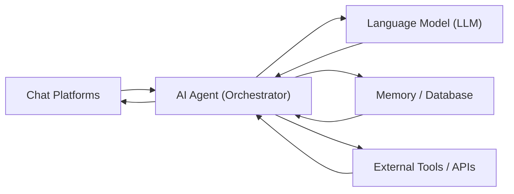
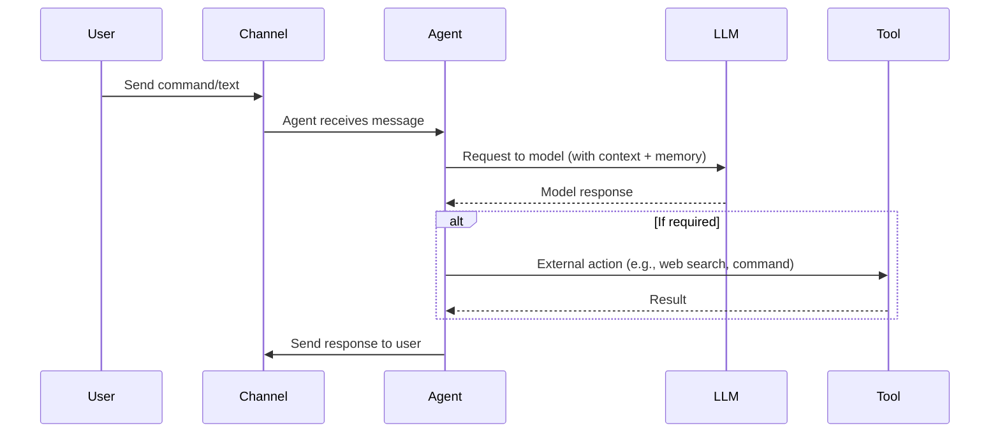

# Summary
The mentioned projects:
* OpenClaw
* ZeroClaw
* NanoClaw
* PicoClaw
* Nanobot
* IronClaw
* TinyClaw
are all **lightweight AI agent frameworks** that allow you to run personalized assistants on your own devices. 
They use common language models (e.g., GPT or Claude) as the “brain” and extend them with “hands” (Claws), meaning the ability to execute real-world tasks. 
They share a multi‑layer architecture: an **agent** receives messages through chat channels (Telegram, WhatsApp, Discord, etc.), forms a request to the LLM using available context and memory, receives a response, and then executes actions (send a message, call an API tool, read/write a file, etc.).  
Most systems support background jobs (schedules), a memory/persistence layer (e.g., SQLite), and plugin‑style tools (web search, code execution, automation scripts). 
Differences mainly appear in programming language, target hardware, performance requirements, and security design.

## Commonalities: Architecture and Workflow
All frameworks essentially follow the same pattern:

- **Input layer (Sensors):** message/input channels (chat apps, CLI, webhooks).
- **Agent / Orchestrator:** a main process that receives messages, assigns them to one or more agents, and plans actions.
- **LLM layer:** a large language model processes the requests (cloud API or local).
- **Memory:** a persistent database or file system stores conversations, notes, or agent context.
- **Tool integration:** connections to external services (search engines, code interpreters, cron jobs).
- **Output layer (Actuators):** the agent sends responses back through the same chat channels or executes system commands.

This architecture is illustrated by the following diagram (simplified):

A typical sequence looks roughly like this:

**Shared patterns:** Almost all systems are open source and allow self‑hosted execution on personal hardware (e.g., Raspberry Pi, Mac Mini, Linux servers). They connect to messaging services through common APIs (Telegram/WhatsApp bots, Discord, Slack, etc.), typically use API tokens or pairing codes for authentication, and usually include built‑in **persistence** (file‑ or SQL‑based storage) for long‑term memory. Technically they differ in programming language (TypeScript/Node.js, Python, Rust, Go, Shell), the security model (sandboxing vs. full access), and the degree of agent collaboration (single agent vs. multi‑agent system). The following sections summarize the key characteristics of the individual projects.

## OpenClaw (Original Project)
**Sources:** Official website and GitHub repository; technical article.

- **Description:** OpenClaw (formerly Clawdbot/Moltbot) is a “full‑feature” AI assistant. It runs in TypeScript/Node.js on Mac/Linux/Windows and is mainly targeted at individual users. It includes a server (“Gateway”) process that connects to many chat channels (WhatsApp, Telegram, Slack, Discord, Signal, Matrix, Teams, IRC, etc.).
- **Hardware:** A capable device is recommended (Mac Mini, Linux server). Official requirement: Node.js ≥22; usually runs 24/7 as a daemon.
- **Components:**
  - **Gateway / Control Plane:** management layer (daemon) for sessions, users, permissions, and events.
  - **Agents / Workspaces:** isolated agent instances can run per user or context (multi‑agent support).
  - **Communication:** wide range of channels; email (IMAP/SMTP) and web interfaces are possible.
  - **Security:** only trusted contacts (pairing) can communicate with the bot by default.
- **Workflow:** OpenClaw uses models such as Claude or ChatGPT for planning and decision making.
- **Scaling:** originally designed for single devices.
- **Differences:** very large codebase (>400k LOC) with high resource consumption.

## NanoClaw
**Sources:** GitHub repository.

- **Description:** NanoClaw is a minimalist OpenClaw reimplementation in TypeScript (Node.js). It focuses on security through isolation: each agent runs inside its own container.
- **Hardware:** Linux/Mac servers with Docker.
- **Components:**
  - **Main process:** Node.js daemon orchestrates operation.
  - **Agents in containers:** messages are processed inside isolated containers.
  - **Channels:** multiple chat apps supported.
  - **Memory:** separate storage per chat or group.
  - **Agent swarms:** teams of specialized agents can collaborate.
- **Security:** container sandboxing limits privileges.
- **Workflow:** commands are addressed via keywords in chat.

## ZeroClaw
**Sources:** GitHub ZeroClaw‑Labs.

- **Description:** Extremely resource‑efficient agent framework written in Rust, designed as an “operating system” for agent workflows.
- **Hardware:** runs on nearly any hardware (ARM, RISC‑V, ESP32‑S3).
- **Features:** static binary, minimal runtime dependencies.
- **Security:** strict sandboxing and localhost binding by default.
- **Performance:** under 5 MB RAM and near‑instant startup.

## PicoClaw
**Sources:** GitHub Sipeed/PicoClaw.

- **Description:** ultra‑light AI assistant written in Go, optimized for extremely low‑cost devices.
- **Hardware:** Raspberry Pi Zero, small RISC‑V boards, Android devices.
- **Performance:** ~10 MB RAM, <1 second startup.
- **Use cases:** IoT control, automation, lightweight assistants.

## Nanobot (HKU)
**Sources:** HKU Nanobot repository.

- **Description:** Python implementation focused on clarity and minimalism (~4,000 lines of code).
- **Hardware:** Linux/macOS with Python.
- **Purpose:** research prototype and experimentation platform.
- **Deployment:** can be started quickly using simple CLI commands.

## IronClaw
**Sources:** official documentatio.

- **Description:** security‑focused agent framework built in Rust.
- **Core concept:** sensitive data never reaches the model directly.
- **Security architecture:**
  - encrypted vault for secrets
  - execution inside WASM sandboxes
  - allow‑listed network access
- **Target users:** enterprises and high‑security environments.

## TinyClaw
Several variants exist:

- **TinyClaw (TinyAGI, TypeScript):** multi‑agent framework enabling teams of agents collaborating on tasks.
- **TinyClaw (Bun version):** plugin‑based system with adaptive memory and agent communication.
- **Other variants:** minimal shell‑script implementations.

Common properties:
- designed for **agent teams**
- dashboards and monitoring
- continuous operation environments

## Comparison Table

| Project | Language / Platform | RAM | Startup | Focus |
|---|---|---|---|---|
| OpenClaw | TypeScript/Node | >1 GB | ~500 s | full‑featured assistant |
| NanoClaw | TypeScript/Node | 100–500 MB | ~30 s | container isolation |
| ZeroClaw | Rust | <5 MB | <0.01 s | ultra‑lightweight |
| PicoClaw | Go | <10 MB | <1 s | edge / IoT |
| Nanobot | Python | ~100 MB | <30 s | research prototype |
| IronClaw | Rust | moderate | cloud | high security |
| TinyClaw | TypeScript | ~200 MB | <5 s | multi‑agent workflows |

## Conclusion
All *Claw* projects share the same underlying concept: **lightweight, open‑source agent frameworks**.  
They differ mainly in priorities—security (IronClaw), extreme efficiency (ZeroClaw, PicoClaw), or feature richness (OpenClaw, TinyClaw).

Architecturally, most follow the same pattern:

**Channels → Agent → LLM / Tools → Response**

Sources: official repositories and documentation.
