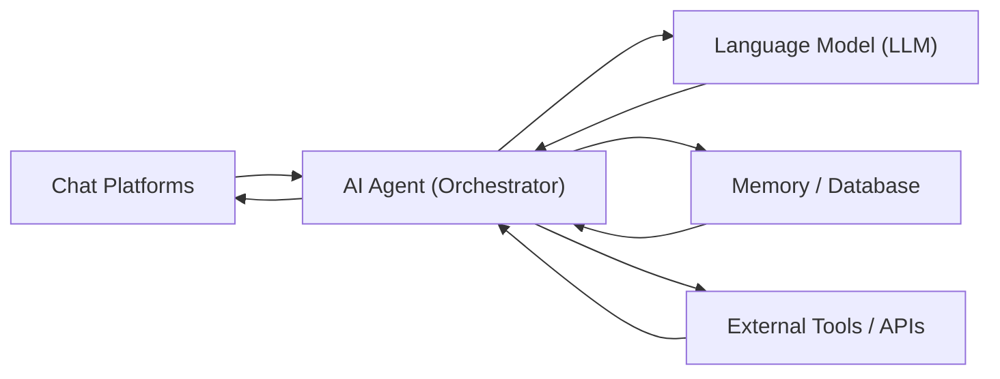
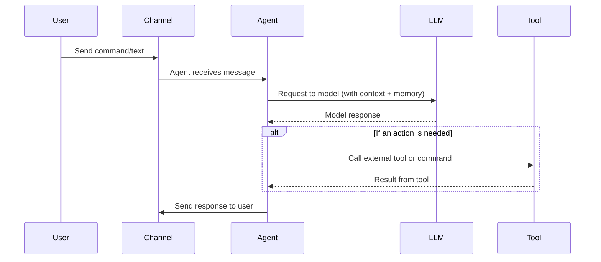

# Summary

The mentioned projects (March, 22. 2026):   

| Project           | Language          | Deployment             | RAM           | Startup   | Focus                     | Interfaces                        | Admin          | Tools / Features                        | MCP     | Security       | GitHub    |
| ----------------- | ----------------- | ---------------------- | ------------- | --------- | ------------------------- | ---------------------------------- | -------------- | ---------------------------------------- | ------- | -------------- | --------- |
| [**ZeroClaw**](https://github.com/zeroclaw-labs/zeroclaw) | Rust              | Static binary / Docker | <5 MB         | <0.01 s   | Ultra-light runtime       | CLI + chat apps                   | CLI + TOML     | Shell, browser, git, HTTP, vector memory | Yes     | Strong         | ⭐ ~28k    |
| [**PicoClaw**](https://github.com/sipeed/picoclaw)      | Go                | Single binary          | <10 MB        | <1 s      | Edge / SBC                | CLI + chat apps                   | YAML / JSON    | Cron, file ops, search, SQLite memory    | Planned | Basic          | ⭐ ~26k    |
| [**LightAgent**](https://github.com/wanxingai/LightAgent) | Python            | pip / CLI              | <10 MB        | <1 s      | Lightweight dev framework | CLI + chat apps                   | CLI + JSON     | Memory, tools, Tree-of-Thought (ToT), multi-agent support | Yes     | Basic          | ⭐ ~0.7k   |
| [**MMClaw**](https://github.com/CrawlScript/MMClaw)      | Python            | pip                    | <10 MB        | <1 s      | Pure-Python agent kernel  | CLI + chat apps (Telegram, QQ, etc.) | CLI + config   | Web, browser, file ops, scheduler, skills | Planned | Basic          | ⭐ ~0.1k   |
| [**Nanobot**](https://github.com/HKUDS/nanobot)          | Python            | pip / Docker           | ~10–100 MB    | <30 s     | Research prototype        | Chat apps + email                | JSON + CLI     | Web, mail, shell, scheduler              | Yes     | Medium         | ⭐ ~35k    |
| [**TinyClaw**](https://github.com/TinyAGI/tinyagi)       | TypeScript        | Node / Docker          | ~200 MB       | <5 s      | Multi-agent orchestration | Discord, WhatsApp, Telegram      | JSON + CLI     | Agent routing, parallel agents           | No      | Low            | ⭐ ~3.2k   |
| [**NanoClaw**](https://github.com/qwibitai/nanoclaw)      | TypeScript        | Docker / Node          | 100–500 MB    | ~30 s     | Container assistant       | Many chat apps                   | JSON + CLI     | Web, Gmail, scheduler                    | Yes     | Medium         | ⭐ ~25k    |
| [**n8n-Claw**](https://github.com/freddy-schuetz/n8n-claw) | Node (n8n)        | Docker (n8n workflows) | ~500+ MB      | Minutes   | Full assistant via n8n    | Telegram, Slack, Teams, HTTP API | n8n Web UI + config | Workflows, RAG memory, tasks, webhooks | Yes     | Medium         | ⭐ ~0.3k   |
| [**OpenClaw**](https://github.com/openclaw/openclaw)     | TypeScript/Node   | Node / Docker          | >1 GB         | ~500 s    | Full assistant            | CLI + many chat apps             | CLI + config   | Browser automation, plugins              | Yes     | Low-Medium     | ⭐ ~247k+  |
| [**IronClaw**](https://github.com/nearai/ironclaw)       | Rust              | Binary + Docker        | >1 GB         | Cloud     | Security-first            | CLI, Web UI, Slack, Telegram     | Web UI + CLI   | WASM sandbox tools                       | Yes     | Very High      | ⭐ ~11k    |

## Commonalities: Architecture and Workflow
All these frameworks share the same layered architecture. Messages enter via **input channels** (chat platforms, CLI, webhooks), then an **Agent** process gathers context (including the long-term **Memory/Database**), calls an LLM for planning, and optionally invokes **Tools/APIs**. The response is sent back through the **output channels**. They typically support background schedules, memory (file- or SQL-based), and pluggable tools (web search, code execution, etc.). The following diagram summarizes the pattern:

A typical message flow:

These projects all allow fully **self-hosted** operation (e.g. on a Raspberry Pi, local server, or VM) and connect to chat platforms (Telegram, WhatsApp, Slack, Discord, etc.) via official APIs or bridges. They use local config files or simple CLIs for setup, and most include built-in persistence for memory and tools integration. They differ in implementation language and emphasis: some target extreme efficiency (Rust/Go), others clarity (pure Python), and some emphasize security or container isolation. The sections below outline each project’s key features.

## OpenClaw (Original Project)
**Sources:** Official GitHub and docs【30†L69-L72】 (OpenClaw origin).  
- **Description:** The first “Claw” assistant, OpenClaw (formerly Clawdbot/Moltbot) is a full-featured AI assistant written in TypeScript/Node.js. It is highly extensible and targets individual users with complex needs.  
- **Hardware:** Typically run on a continuously-on server (e.g., Linux server or Mac Mini). It requires Node.js ≥22 and usually runs as a daemon.  
- **Components:**  
  - **Gateway/Control Plane:** Manages sessions, users, pairing and permissions.  
  - **Agents/Workspaces:** Supports isolated agent instances (“workspaces”) per user or context (multi-agent capable).  
  - **Channels:** Wide chat integration (WhatsApp, Telegram, Slack, Discord, Signal, Matrix, Teams, IRC, etc.) plus optional email (IMAP/SMTP) and web UI.  
  - **Security:** By default only paired contacts can communicate; has user/pairing codes.  
- **Workflow:** Uses LLMs (e.g. OpenAI GPT, Anthropic Claude) for planning and decision-making.  
- **Features:** Very comprehensive (e.g. browser automation, plugins). Large codebase (~500K LOC) and resource usage is high. It is designed for flexibility over minimalism.  

## NanoClaw
**Sources:** Official GitHub (qwibitai/nanoclaw).  
- **Description:** A minimalist reimplementation of OpenClaw in Node.js/TypeScript focusing on security. Each agent (Claude-based) runs in its own container (Docker) to ensure OS-level isolation. It aims to be understandable and fully customizable.  
- **Hardware:** Linux/Mac systems with Docker support.  
- **Components:**  
  - **Main Daemon:** A Node.js process orchestrates messages.  
  - **Agent Containers:** Individual agents run inside Linux containers (or macOS app containers) with only mounted directories exposed.  
  - **Channels:** Supports Telegram, WhatsApp, Slack, Discord, Gmail and more via integrations.  
  - **Memory:** Per-user or per-chat SQLite/JSON memory; can also load or sync markdown project notes.  
  - **Security:** Emphasizes isolation: agents run in containers; strict allow-lists for network and file access. Tools and code execution happen inside sandboxed containers or WASM.  
- **Features:** Webhooks, scheduler jobs, Chrome DevTools-based scripting, RESTful API for tools.  
- **Workflow:** Interaction is via slash commands or chat.  
- **Status:** Smaller codebase than OpenClaw, ~25k stars on GitHub.  

## n8n-Claw
**Sources:** Official GitHub (freddy-schuetz/n8n-claw)【63†L299-L303】.  
- **Description:** A self-hosted AI assistant built entirely on the n8n automation platform. It combines n8n workflows, a PostgreSQL database, and Anthropic Claude to create an agent similar to OpenClaw, all configurable through no-code flows and a web UI【63†L299-L303】.  
- **Hardware:** Runs on a Linux VM or server with Docker. n8n-claw comes as a setup script that installs n8n, Postgres, and related services.  
- **Components:**  
  - **n8n Workflows:** The “agent logic” is defined as n8n flows (built-in automations), which handle message parsing, tool calls, and scheduling.  
  - **Database:** PostgreSQL stores chat history, memory, and task data.  
  - **Communication:** Uses webhooks/APIs to receive input: a Telegram bot and generic HTTP endpoints (e.g. Slack/Teams) send user messages into n8n.  
  - **Memory & Tools:** Offers adaptive long-term memory (with RAG search) and can build new tools via MCP skill templates on-the-fly. It includes built-in skills (web search via SearXNG, webpage reading via Crawl4AI, etc.).  
  - **Security:** Runs n8n inside Docker; relies on standard security practices of the stack. Access control is managed by n8n credentials and any password/SSH on the host.  
- **Workflow:** Users chat with the agent (Telegram or via an HTTP REST API). The agent manages tasks, sends reminders, and can proactively trigger actions on schedule【63†L299-L303】.  
- **Features:** Task manager, reminders (cron-like), project documents (markdown), expert sub-agents, and continuous background “heartbeat” processes.  
- **Status:** ~285 stars. Focuses on no-code convenience and extensibility through the n8n ecosystem.

## ZeroClaw
**Sources:** ZeroClaw Labs GitHub.  
- **Description:** A very lightweight agent framework written in Rust, described as an “operating system” for agents. It provides near-instant cold starts and a tiny binary footprint. ZeroClaw is designed for extreme efficiency (aiming to run on low-power boards and microcontrollers).  
- **Hardware:** Runs on practically any platform (x86, ARM, RISC-V, even ESP32-S3).  
- **Components:**  
  - **Single Binary:** A statically linked Rust executable includes the agent logic and a minimal web server.  
  - **Channels:** Basic CLI and the ability to bridge to chat apps.  
  - **Memory:** Built-in vector memory support; limited persistence by default (lean design).  
  - **Security:** Strong sandboxing and binding to localhost by default; explicitly hardened for minimal privilege.  
- **Performance:** Very low resource usage (<5 MB RAM) and instant startup (<0.01 s cold start on small hardware).  
- **Features:** Shell access, file operations, web requests; uses the MCP protocol for tool integrations.  
- **Status:** ~28k stars. Emphasizes being ultra-small and fast.

## PicoClaw
**Sources:** PicoClaw GitHub.  
- **Description:** An independent ultra-light assistant framework written in Go, not a fork of OpenClaw/Nanobot. It was “AI-bootstrapped” by iterative refinement. PicoClaw is optimized for running on very cheap hardware (Raspberry Pi Zero, small RISC-V, Android).  
- **Hardware:** Very low-cost hardware (~$10 boards). Single self-contained Go binary across architectures (RISC-V, ARM, x86).  
- **Components:**  
  - **Single Binary:** CLI daemon with optional web UI, no external dependencies.  
  - **Channels:** Supports CLI and Telegram out-of-the-box (others via proxy).  
  - **Memory:** JSONL/SQLite stores; can use SQLite for index-search.  
  - **Security:** Basic; intended for hobbyist/edge use, not hardened.  
- **Performance:** Boot in <1 second, <10MB RAM usage (project goals mention 10–20MB). 99% smaller memory footprint than OpenClaw【37†L378-L386】.  
- **Features:** Minimal core (cron jobs, file ops, HTTP, vector memory). Recent updates added MCP tool support, more channels (Matrix, IRC, Discord), and a system tray UI for desktop.  
- **Status:** Rapidly growing (~26k stars). Focus is extreme efficiency for IoT/edge scenarios【37†L378-L386】.

## Nanobot (HKU)
**Sources:** Nanobot GitHub.  
- **Description:** A Python-based ultra-light assistant inspired by OpenClaw. It emphasizes simplicity and clarity (~4,000 LOC) while providing core agent functions.  
- **Hardware:** Any system that runs Python; can be deployed via `pip` or Docker.  
- **Components:**  
  - **Single Process:** Python agent loop, no heavy frameworks.  
  - **Channels:** Chatbot interfaces for Telegram, Slack, DingTalk, WeCom, etc. Email integration is also supported.  
  - **Memory:** File-based (JSON) memory per user or workspace; no external database required.  
  - **Security:** Typical Python process security; sandboxing via configuration scopes.  
- **Features:** Webhooks, shell execution, scheduled tasks (cron), media handling, and simple skill extension. Suitable as a research prototype or teaching tool.  
- **Workflow:** Command-driven via chat; limited but stable feature set.  
- **Status:** ~35k stars. Focused on readability and ease of modification.

## MMClaw
**Sources:** MMClaw GitHub【25†L282-L288】【67†L378-L386】.  
- **Description:** A “pipclaw” renamed to MMClaw, this is a pure-Python agent kernel. It strips away all non-Python dependencies (no Node.js or Docker needed) to make the codebase entirely transparent. It serves as both a ready-to-use assistant and an educational reference for building agents.  
- **Hardware:** Runs on Windows/macOS/Linux with Python 3.8+. Very light requirements.  
- **Components:**  
  - **Python Core:** Everything is in one Python process.  
  - **Channels:** CLI/Terminal interface plus chat connectors (Telegram, WhatsApp via a Node bridge, and Chinese platforms like Feishu, QQ)【67†L378-L386】.  
  - **Memory:** Configurable (e.g. JSON file) per workspace; persistent via local files.  
  - **Security:** Basic (relying on OS user permissions); not sandboxed.  
- **Features:** Built-in skills include web search, browser automation (Playwright), image/PDF analysis, and a simple knowledge graph for skills.  
- **Setup:** Easy installation with `pip install mmclaw`; run with `mmclaw run`.  
- **Status:** ~124 stars. Emphasizes clarity (core code ~1000 LOC)【25†L282-L288】 and ease of understanding.

## LightAgent
**Sources:** LightAgent GitHub【65†L328-L332】【65†L344-L347】.  
- **Description:** A lightweight Python framework for building agentic applications. It provides built-in long-term memory (`mem0`), tool integration, and an internal “Tree of Thought” reasoning module. It supports multi-agent collaboration (called LightSwarm) and self-learning abilities for agents【65†L328-L332】.  
- **Hardware:** Any Python-capable system. No C extensions or external frameworks are required (just Python 3.10+).  
- **Components:**  
  - **Python Core:** Minimalist design (only ~1000 lines of code)【65†L344-L347】.  
  - **Channels:** Interact via command-line or integrate with chat apps (it can stream responses in OpenAI format to chat UIs).  
  - **Memory:** Supports per-user session memory with a modular memory backend (`mem0`).  
  - **Security:** Basic (agents run in-process). Emphasis is on development ease rather than hardened security.  
- **Features:** Tool support (MCP protocol), multi-model (OpenAI, Baichuan, DeepSeek, etc.), and automatic tool generation from API docs. Agents can refine themselves over time.  
- **Status:** ~737 stars. Marketed as “production-level open-source agent development framework”【65†L328-L332】.

## IronClaw
**Sources:** IronClaw GitHub (nearai/ironclaw).  
- **Description:** A Rust-based agent framework with a security-first design. IronClaw is built for enterprise use, ensuring user data and secrets never leak to the model.  
- **Hardware:** Medium/large servers; requires PostgreSQL for storage. Rust binaries for performance.  
- **Components:**  
  - **WASM Tools:** Untrusted tools are compiled to WebAssembly and run in capability-based sandboxes with network/file allowlists.  
  - **Vault:** Credentials and secrets are stored encrypted, injected only to approved contexts.  
  - **Channels:** Web-based gateway (browser UI), REPL, Slack/Telegram integrations via secure tunnels.  
  - **Memory:** Hybrid approach (full-text + vector search via SQL).  
- **Security:** Defense-in-depth: strict input/output sanitization, allowlisting, prompt-injection filtering, and hardened runtime.  
- **Features:** Parallel execution, self-healing (automatic retries), custom WebAssembly tools, and cron-like triggers.  
- **Status:** ~11k stars. Targets high-security environments.  

## TinyClaw
**Sources:** TinyAGI GitHub (formerly TinyClaw).  
- **Description:** A TypeScript/Node framework for multi-agent orchestration. It’s aimed at running "teams" of agents with specialized roles. TinyClaw includes a web dashboard (TinyOffice) for managing agents, teams, tasks, and chats.  
- **Hardware:** Desktop or server; runs on Node.js 18+.  
- **Components:**  
  - **Daemon:** Node.js backend managing a message queue and worker agents.  
  - **Agents/Teams:** You can define multiple agents and group them into teams. Agents can delegate tasks to other agents (chain-of-command style).  
  - **Channels:** Connect to Discord, WhatsApp, Telegram via bots.  
  - **Memory:** SQLite queues and local JSON config; conversation state is preserved across restarts.  
  - **Dashboard:** Web UI (TinyOffice) for real-time monitoring of teams, tasks, and chats.  
- **Features:** Parallel processing (agents work concurrently), plug-in hooks, persistent chat rooms per team, and Kanban-style task boards.  
- **Security:** Light – treats all code as trusted; focus is on collaboration features.  
- **Status:** ~3.2k stars. Emphasizes team-based agent workflows.

## Conclusion
All **Claw**-style projects (and similar frameworks) share the same core concept: they are **open-source, self-hosted agent assistants**. They connect chat apps or CLI inputs to an LLM “brain” and extend it with real-world “hands” (tools and actions). The differences lie in their priorities and trade-offs: 
- **Performance & Edge:** *ZeroClaw*, *PicoClaw* are optimized for minimal footprint and fast startup on small hardware.  
- **Simplicity:** *Nanobot*, *MMClaw*, *LightAgent* offer small, clear codebases for easy customization or research use.  
- **Security:** *IronClaw* and *n8n-Claw* focus on stricter isolation of code and data (WASM or containers, encrypted vaults).  
- **Containerization:** *NanoClaw* ensures each agent runs in its own Docker container for maximum isolation.  
- **Rich Features:** *OpenClaw* (and variants like n8n-Claw) and *TinyClaw* provide extensive integrations and multi-agent workflows (teams, dashboards).  

Despite varied languages (TypeScript/Node, Python, Rust, Go) and designs, they all implement the same loop: 

**User message → Agent orchestrator → (LLM + context/memory) → (Optional tool invocation) → Response → User.**  

This architecture makes it possible to run personalized AI assistants on your own devices using models like GPT or Claude, extending them with automation capabilities.  

*Sources: Official project repositories and documentation as cited above.*