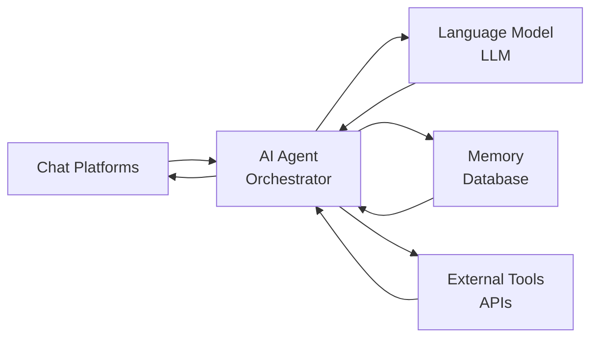
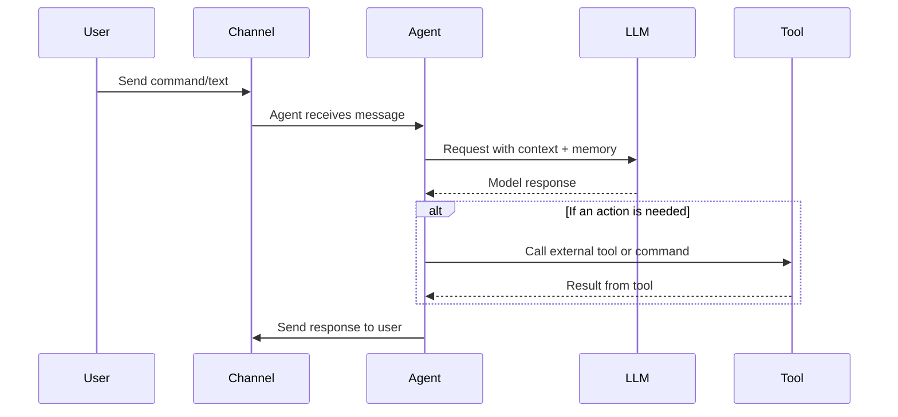

# AI Agent Frameworks – Terminal & Assistant Agents

The mentioned projects (May, 18. 2026):  

| Project | Language | Deployment | RAM | Startup | Focus | Interfaces | Admin | Tools / Features | MCP | Security | GitHub |
|---|---|---|---|---|---|---|---|---|---|---|---|
| [ZeroClaw](https://github.com/zeroclaw-labs/zeroclaw) | Rust | Static binary / Docker | <5 MB | <0.01 s | Ultra-light runtime | CLI + chat apps | CLI + TOML | Shell, browser, git, HTTP, vector memory | Yes | Strong | ⭐ ~31k |
| [PicoClaw](https://github.com/sipeed/picoclaw) | Go | Single binary | <10 MB | <1 s | Edge / SBC | CLI + chat apps | YAML / JSON | Cron, file ops, search, SQLite memory | Yes | Basic | ⭐ ~29k |
| [LightAgent](https://github.com/wanxingai/LightAgent) | Python | pip / CLI | <10 MB | <1 s | Lightweight dev framework | CLI + chat apps | CLI + JSON | Memory, tools, Tree-of-Thought (ToT), multi-agent | Yes | Basic | ⭐ ~1k |
| [MMClaw](https://github.com/CrawlScript/MMClaw) | Python | pip | <10 MB | <1 s | Pure-Python agent kernel | CLI + chat apps (Telegram, QQ, etc.) | CLI + config | Web, browser, file ops, scheduler, skills | Planned | Basic | ⭐ ~137 |
| [Nanobot](https://github.com/HKUDS/nanobot) | Python | pip / Docker | ~10–100 MB | <30 s | Research prototype | Chat apps + email | JSON + CLI | Web, mail, shell, scheduler | Yes | Medium | ⭐ ~43k |
| [OpenCode](https://github.com/opencode-ai/opencode) | Go | Binary / npm / Docker | ~50–200 MB | < 3s | Open-source coding agent | CLI, IDE, desktop | CLI + config | LSP, 75+ LLM providers, MCP, file ops, plugin system | Yes (ACP) | Medium | ⭐ ~13k |
| [Hermes Agent](https://github.com/NousResearch/hermes-agent) | Python | pip / binary / Docker | ~50–500 MB | <5 s | Self-improving full assistant | 18+ platforms (Telegram, Discord, Slack, WhatsApp, Signal, Email, CLI) | CLI + config + TUI | Skills system, subagents, memory, cron, web, browser, terminal, file, vision, MCP client | Yes (native) | Medium-High | ⭐ ~155k |
| [Codex CLI](https://github.com/openai/codex) | Rust | Binary / npm | ~10–50 MB | <1 s | Lightweight coding agent | CLI, terminal | CLI + config | Code editing, shell, git, sandboxes, OpenAI models | Planned | Medium | ⭐ ~83k |
| [Copilot CLI](https://github.com/github/copilot-cli) | TypeScript | npm | ~100–200 MB | < 3s | Terminal coding + ACP | CLI, ACP server | CLI + config | Code editing, git, ACP protocol, GitHub-native integration | Yes (ACP) | Medium | ⭐ ~11k |
| [Droid](https://github.com/Factory-AI/factory) | TypeScript/Python | npm | ~100–300 MB | <5 s | Agent-native software development | CLI, VS Code, ACP | CLI + config | PR automation, code review, security scan, code generation | Yes (ACP) | Medium | ⭐ ~885 |
| [TinyClaw](https://github.com/TinyAGI/tinyagi) | TypeScript | Node / Docker | ~200 MB | <5 s | Multi-agent orchestration | Discord, WhatsApp, Telegram | JSON + CLI | Agent routing, parallel agents | No | Low | ⭐ ~4k |
| [Claude Code](https://github.com/anthropics/claude-code) | TypeScript | npm | ~200–500 MB | <5 s | Agentic coding (proprietary) | CLI, terminal | CLI + config | Code editing, git, shell execution, npm, Anthropic models | Yes (ACP) | Medium | ⭐ ~124k |
| [Pool](https://github.com/poolsideai/pool) | TypeScript | npm | ~200–300 MB | < 3s | ACP orchestrator / coding agent | CLI, ACP editors | CLI + config | Multi-Agent ACP orchestration, terminal, desktop | Yes (ACP) | Medium | ⭐ ~174 |
| [Pi](https://github.com/earendil-works/pi) | TypeScript | npm / binary | ~200–500 MB | <5 s | AI agent toolkit / coding agent | CLI, TUI, web UI, Slack | CLI + config | Unified LLM API, vLLM pods, TUI/web UI, extension system | Yes (ACP) | Medium | ⭐ ~51k |
| [n8n-Claw](https://github.com/freddy-schuetz/n8n-claw) | Shell (n8n) | Docker (n8n workflows) | ~500+ MB | Minutes | Full assistant via n8n | Telegram, Slack, Teams, HTTP API | n8n Web UI + config | Workflows, RAG memory, tasks, webhooks | Yes | Medium | ⭐ ~438 |
| [OpenClaw](https://github.com/openclaw/openclaw) | TypeScript/Node | Node / Docker | >1 GB | ~500 s | Full assistant | CLI + many chat apps | CLI + config | Browser automation, plugins | Yes | Low-Medium | ⭐ ~373k |
| [IronClaw](https://github.com/nearai/ironclaw) | Rust | Binary + Docker | >1 GB | Cloud | Security-first | CLI, Web UI, Slack, Telegram | Web UI + CLI | WASM sandbox tools | Yes | Very High | ⭐ ~12k |

---

## Commonalities: Architecture and Workflow

All these frameworks share the same layered architecture. Messages enter via input channels (chat platforms, CLI, webhooks), then an Agent process gathers context (including the long-term Memory/Database), calls an LLM for planning, and optionally invokes Tools/APIs. The response is sent back through the output channels.

They typically support background schedules, memory (file- or SQL-based), and pluggable tools (web search, code execution, etc.).

The following diagram summarizes the pattern:

A typical message flow:

These projects all allow fully self-hosted operation (e.g. on a Raspberry Pi, local server, or VM) and connect to chat platforms (Telegram, WhatsApp, Slack, Discord, etc.) via official APIs or bridges. They use local config files or simple CLIs for setup, and most include built-in persistence for memory and tools integration. They differ in implementation language and emphasis: some target extreme efficiency (Rust/Go), others clarity (pure Python), and some emphasize security or container isolation.

**New trend – ACP (Agent Client Protocol):** An emerging standard for communication between AI agents and clients. Copilot CLI, Claude Code, Codex, OpenCode, Pool, Gemini CLI and others all implement ACP, enabling interoperability between agents, IDEs, CI/CD pipelines, and multi-agent systems. See [Agent Client Protocol on GitHub](https://github.com/topics/agent-client-protocol).

---

## OpenClaw (Original Project)

**Sources:** [GitHub](https://github.com/openclaw/openclaw), [docs](https://docs.openclaw.dev)

- **Description:** The first "Claw" assistant, OpenClaw (formerly Clawdbot/Moltbot) is a full-featured AI assistant written in TypeScript/Node.js. Highly extensible and targets individual users with complex needs.
- **Hardware:** Typically run on a continuously-on server (e.g., Linux server or Mac Mini). Requires Node.js ≥22 and usually runs as a daemon.
- **Components:**
  - Gateway/Control Plane: Manages sessions, users, pairing and permissions
  - Agents/Workspaces: Supports isolated agent instances ("workspaces") per user or context (multi-agent capable)
  - Channels: Wide chat integration (WhatsApp, Telegram, Slack, Discord, Signal, Matrix, Teams, IRC, etc.) plus optional email (IMAP/SMTP) and web UI
  - Security: By default only paired contacts can communicate; has user/pairing codes
- **Workflow:** Uses LLMs (e.g. OpenAI GPT, Anthropic Claude) for planning and decision-making
- **Features:** Very comprehensive (e.g. browser automation, plugins). Large codebase (~500K LOC) and resource usage is high. Designed for flexibility over minimalism

---

## Claude Code

**Sources:** [GitHub](https://github.com/anthropics/claude-code), [Anthropic](https://www.anthropic.com/product/claude-code)

- **Description:** Anthropic's agentic coding tool that lives in your terminal, understands your codebase, and helps you code faster by executing routine tasks, explaining complex code, and handling git workflows – all through natural language commands
- **Hardware:** Any system with Node.js; proprietary, requires Anthropic API access
- **Components:**
  - CLI daemon with built-in tool system (Edit, Shell, Read, Write, Grep, ls, Glob)
  - Codebase index for context understanding
  - Git integration: branch, commit, PR, diff
  - ACP server for IDE integration (VS Code, JetBrains, Zed)
- **Security:** Medium – runs as a process, uses Anthropic API credentials
- **Workflow:** Command-driven via CLI; Claude plans and executes code changes
- **Features:** Deep codebase understanding, native git workflow integration, ACP support. Only works with Anthropic models

---

## Codex CLI

**Sources:** [GitHub](https://github.com/openai/codex)

- **Description:** OpenAI's coding agent that runs locally on your computer. Part of the ChatGPT/Codex ecosystem – for IDE integration, Codex is available in VS Code, Cursor, Windsurf
- **Hardware:** Any system with Rust binary; npm-based installation
- **Components:**
  - CLI agent with code editing, shell execution, git integration
  - Sandbox mode for safe code execution
  - OpenAI models (GPT-4o, o3, etc.)
- **Security:** Medium – proprietary, requires OpenAI credentials
- **Workflow:** Terminal-first; natural language input, Codex executes code changes and commands
- **Features:** Rapid release cadence (~weekly), enterprise features, deeply integrated with ChatGPT subscription. ~83k stars, 3rd most starred terminal coding agent

---

## Hermes Agent

**Sources:** [GitHub](https://github.com/NousResearch/hermes-agent), [docs](https://hermes-agent.nousresearch.com/docs/)

- **Description:** The self-improving AI agent from Nous Research – the only agent with a built-in learning loop. It creates skills from experience, improves them during use, and builds a deepening model of who you are
- **Hardware:** Linux server, Raspberry Pi, macOS; pip or binary install
- **Components:**
  - Gateway server with 18+ platform connectors (Telegram, Discord, Slack, WhatsApp, Signal, Email, etc.)
  - Terminal UI (TUI) as second entry point
  - Skills system: agent creates, maintains, and consolidates skills autonomously
  - Subagents with their own conversations, terminals, and Python RPC scripts
  - Built-in cron scheduler with delivery to any platform
  - Persistent long-term memory, session search, user profile
  - Native MCP client for tool discovery
- **Security:** Medium-High – local operation, configurable access control
- **Workflow:** Conversational via chat or TUI; agent organizes tools, skills, and subagents autonomously
- **Features:** Autonomous self-improvement via curator, skill-generated knowledge loop, vision/image processing, browser automation, terminal and file access, web search/extract. ~155k stars, fastest-growing agent framework

---

## OpenCode

**Sources:** [GitHub](https://github.com/opencode-ai/opencode), [opencode.ai](https://opencode.ai/)

- **Description:** An open-source AI coding agent that runs in your terminal or desktop. Free of provider lock-in – supports 75+ LLM providers including existing ChatGPT Plus and GitHub Copilot subscriptions
- **Hardware:** Any system with Go binary; via npm, Homebrew, Cargo, APT, or binary install
- **Components:**
  - CLI agent with ACP server mode
  - LSP integration for code intelligence
  - File change tracking with visualization
  - Plugin system for custom commands
  - 5M+ monthly active developers
- **Security:** Medium – locally running agent
- **Workflow:** Terminal-first; natural language input for coding tasks
- **Features:** Model-agnostic, MCP support, ACP compatibility, desktop and IDE integration. ~13k stars, growing fast due to provider independence

---

## Copilot CLI

**Sources:** [GitHub](https://github.com/github/copilot-cli), [docs](https://docs.github.com/copilot/concepts/agents/about-copilot-cli)

- **Description:** GitHub Copilot CLI brings the power of Copilot coding agent directly to your terminal. ACP support since January 2026
- **Hardware:** Any system with Node.js
- **Components:**
  - CLI agent for code editing and git workflows
  - ACP server: `gh copilot chat --acp` – enables integration into any IDE, CI/CD, and multi-agent systems
  - GitHub-native integration (issues, PRs, repos)
- **Security:** Medium – requires GitHub account & Copilot subscription
- **Workflow:** Terminal-first; also usable as ACP server for third-party integration
- **Features:** Agent Client Protocol since v1.0 (April 2026), extremely strong for GitHub ecosystem. ~11k stars

---

## Nanobot (HKU)

**Sources:** [GitHub](https://github.com/HKUDS/nanobot)

- **Description:** A Python-based ultra-light assistant inspired by OpenClaw. Emphasizes simplicity and clarity (~4,000 LOC) while providing core agent functions
- **Hardware:** Any system that runs Python; can be deployed via pip or Docker
- **Components:**
  - Single process: Python agent loop, no heavy frameworks
  - Channels: Chatbot interfaces for Telegram, Slack, DingTalk, WeCom, etc. Email integration is also supported
  - Memory: File-based (JSON) memory per user or workspace; no external database required
  - Security: Typical Python process security; sandboxing via configuration scopes
- **Features:** Webhooks, shell execution, scheduled tasks (cron), media handling, simple skill extension
- **Workflow:** Command-driven via chat; limited but stable feature set

---

## Pi

**Sources:** [GitHub](https://github.com/earendil-works/pi), [pi.dev](https://pi.dev/)

- **Description:** The AI agent toolkit behind OpenClaw. TypeScript monorepo with modular architecture: pi-ai (LLM communication), pi-agent-core (agent loop with tool calling), pi-coding-agent (full coding agent), Extensions for TUI/Web UI
- **Hardware:** node/npm, macOS/Linux/Windows
- **Components:**
  - Monorepo with multiple packages (layering architecture)
  - Unified LLM API across providers
  - TUI & Web UI libraries
  - Slack bot, vLLM pods for local model inference
  - Extension system: TypeScript modules with access to tools, commands, keyboard shortcuts, events
- **Security:** Medium – locally runnable, configurable
- **Workflow:** Extensible – extensions define the workflow; "features other agents bake in, you build yourself here"
- **Features:** The infrastructure layer behind OpenClaw. ~51k stars

---

## TinyClaw

**Sources:** [GitHub](https://github.com/TinyAGI/tinyagi)

- **Description:** A TypeScript/Node framework for multi-agent orchestration. Aimed at running "teams" of agents with specialized roles. Includes a web dashboard (TinyOffice) for managing agents, teams, tasks, and chats
- **Hardware:** Desktop or server; runs on Node.js 18+
- **Components:**
  - Daemon: Node.js backend managing a message queue and worker agents
  - Agents/Teams: Define multiple agents and group them into teams. Agents can delegate tasks (chain-of-command style)
  - Channels: Connect to Discord, WhatsApp, Telegram via bots
  - Memory: SQLite queues and local JSON config; conversation state preserved across restarts
  - Dashboard: Web UI (TinyOffice) for real-time monitoring
- **Features:** Parallel processing, plug-in hooks, persistent chat rooms per team, Kanban-style task boards
- **Security:** Light – treats all code as trusted; focus is on collaboration features

---

## IronClaw

**Sources:** [GitHub](https://github.com/nearai/ironclaw)

- **Description:** A Rust-based agent framework with a security-first design. Built for enterprise use, ensuring user data and secrets never leak to the model
- **Hardware:** Medium/large servers; requires PostgreSQL for storage. Rust binaries for performance
- **Components:**
  - WASM Tools: Untrusted tools compiled to WebAssembly, run in capability-based sandboxes with network/file allowlists
  - Vault: Credentials and secrets stored encrypted, injected only to approved contexts
  - Channels: Web-based gateway (browser UI), REPL, Slack/Telegram via secure tunnels
  - Memory: Hybrid approach (full-text + vector search via SQL)
- **Security:** Defense-in-depth: strict input/output sanitization, allowlisting, prompt-injection filtering, hardened runtime
- **Features:** Parallel execution, self-healing (automatic retries), custom WebAssembly tools, cron-like triggers

---

## ZeroClaw

**Sources:** [GitHub](https://github.com/zeroclaw-labs/zeroclaw)

- **Description:** A very lightweight agent framework written in Rust, described as an "operating system" for agents. Near-instant cold starts and a tiny binary footprint. Designed for extreme efficiency
- **Hardware:** Runs on practically any platform (x86, ARM, RISC-V, even ESP32-S3)
- **Components:**
  - Single binary: statically linked Rust executable with agent logic and minimal web server
  - Channels: Basic CLI and ability to bridge to chat apps
  - Memory: Built-in vector memory support; limited persistence by default (lean design)
  - Security: Strong sandboxing, binding to localhost by default; hardened for minimal privilege
- **Performance:** Very low resource usage (<5 MB RAM), instant startup (<0.01 s cold start on small hardware)
- **Features:** Shell access, file operations, web requests; uses MCP protocol for tool integrations

---

## PicoClaw

**Sources:** [GitHub](https://github.com/sipeed/picoclaw)

- **Description:** An independent ultra-light assistant framework in Go, not a fork of OpenClaw/Nanobot. Optimized for cheap hardware (Raspberry Pi Zero, small RISC-V, Android)
- **Hardware:** Very low-cost hardware (~$10 boards). Single self-contained Go binary across architectures (RISC-V, ARM, x86)
- **Components:**
  - Single binary: CLI daemon with optional web UI, no external dependencies
  - Channels: Supports CLI and Telegram out-of-the-box (others via proxy)
  - Memory: JSONL/SQLite stores; SQLite index-search
  - Security: Basic; intended for hobbyist/edge use
- **Performance:** Boot in <1 second, <10 MB RAM. 99% smaller memory footprint than OpenClaw
- **Features:** Cron jobs, file ops, HTTP, vector memory. Recent updates: MCP tool support, Matrix, IRC, Discord, system tray UI

---

## Pool (Poolside AI)

**Sources:** [GitHub](https://github.com/poolsideai/pool), [poolside.ai](https://poolside.ai/)

- **Description:** Poolside's coding agent that runs in your terminal or integrates with any ACP-compatible editor. Based on Poolside's own models (Laguna)
- **Hardware:** npm / Go
- **Components:**
  - CLI agent with ACP integration
  - Proprietary models: Laguna XS.2 (open, local), Laguna m.1 (cloud)
  - Shimmer IDE with direct agent integration
  - Top performer on SWE-bench Verified and Terminal-Bench 2.0
- **Security:** Medium – local or cloud-based
- **Workflow:** `pool --agent-server claude-agent-acp` or `pool --agent-server codex-acp` – ACP orchestration across multiple agents
- **Features:** Own MoE models, extremely strong on coding benchmarks, Shimmer desktop IDE

---

## Droid (Factory AI)

**Sources:** [GitHub](https://github.com/Factory-AI/factory)

- **Description:** Agent-native software development. Droid is Factory AI's coding agent, top-ranked in terminal benchmarks
- **Hardware:** Node.js / npm; VS Code extension available; JetBrains/Zed via ACP
- **Components:**
  - Droid CLI for terminal-based coding
  - Droid Action: AI-powered code reviews, security scans, PR descriptions automatically on pull requests
  - ACP support for JetBrains and Zed
- **Security:** Medium – proprietary
- **Workflow:** Start `droid` in terminal, mission-based tasks via `droid exec --mission`
- **Features:** CI/CD integration, security scanning, PR automation

---

## n8n-Claw

**Sources:** [GitHub](https://github.com/freddy-schuetz/n8n-claw)

- **Description:** A self-hosted AI assistant built entirely on the n8n automation platform. Combines n8n workflows, PostgreSQL, and Anthropic Claude to create an agent similar to OpenClaw, all configurable through no-code flows and a web UI
- **Hardware:** Runs on a Linux VM or server with Docker
- **Components:**
  - n8n Workflows: Agent logic defined as n8n flows, handling message parsing, tool calls, scheduling
  - Database: PostgreSQL stores chat history, memory, and task data
  - Communication: Webhooks/APIs for input; Telegram bot and HTTP endpoints (Slack/Teams)
  - Memory & Tools: Adaptive long-term memory with RAG search, MCP skill templates
  - Security: Docker-based; standard security practices
- **Workflow:** Chat with agent via Telegram or HTTP REST API; manages tasks, reminders, proactive scheduled actions
- **Features:** Task manager, reminders (cron-like), project documents, expert sub-agents, background heartbeat processes

---

## LightAgent

**Sources:** [GitHub](https://github.com/wanxingai/LightAgent)

- **Description:** A lightweight Python framework for building agentic applications. Built-in long-term memory (mem0), tool integration, Tree-of-Thought reasoning module
- **Hardware:** Any Python-capable system. No C extensions or external frameworks (Python 3.10+)
- **Components:**
  - Python core: minimalist design (~1000 lines of code)
  - Channels: CLI or integrate with chat apps (OpenAI format streaming)
  - Memory: Per-user session memory with modular backend (mem0)
  - Security: Basic (in-process agents)
- **Features:** Tool support (MCP protocol), multi-model (OpenAI, Baichuan, DeepSeek), automatic tool generation from API docs, multi-agent collaboration (LightSwarm), self-learning
- **Marketed as:** "Production-level open-source agent development framework"

---

## MMClaw

**Sources:** [GitHub](https://github.com/CrawlScript/MMClaw)

- **Description:** A pure-Python agent kernel (formerly "pipclaw"). Strips away all non-Python dependencies (no Node.js or Docker) to make the codebase entirely transparent
- **Hardware:** Windows/macOS/Linux with Python 3.8+
- **Components:**
  - Python core: everything in one process
  - Channels: CLI/Terminal plus chat connectors (Telegram, WhatsApp via Node bridge, Feishu, QQ)
  - Memory: JSON file per workspace; persistent via local files
  - Security: Basic (OS user permissions); not sandboxed
- **Features:** Web search, browser automation (Playwright), image/PDF analysis, knowledge graph for skills
- **Setup:** `pip install mmclaw; mmclaw run`. Core code ~1000 LOC

---

## Conclusion

All Claw-style projects (and similar frameworks) share the same core concept: they are open-source, self-hosted agent assistants. They connect chat apps or CLI inputs to an LLM "brain" and extend it with real-world "hands" (tools and actions). The differences lie in their priorities and trade-offs:

- **Performance & Edge:** *ZeroClaw*, *PicoClaw* optimized for minimal footprint and fast startup on small hardware
- **Simplicity:** *Nanobot*, *MMClaw*, *LightAgent* offer small, clear codebases for easy customization or research use
- **Security:** *IronClaw* focuses on strict isolation of code and data (WASM, encrypted vaults)
- **Rich Features:** *OpenClaw* (~373k stars) and *Hermes Agent* (~155k stars) offer extensive integrations, multi-agent workflows, and self-improvement
- **Terminal Coding Agents:** *Claude Code* (~124k), *Codex CLI* (~83k), *OpenCode* (~13k), *Copilot CLI* (~11k) – the new breed of terminal-native coding agents, many implementing ACP for interoperability
- **ACP Standardization:** An emerging trend is the [Agent Client Protocol](https://github.com/topics/agent-client-protocol) (ACP) – implemented by Claude Code, Copilot CLI, Codex, OpenCode, Pool, Gemini CLI and others, enabling interoperability between agents, IDEs, CI/CD, and multi-agent systems

Despite varied languages (TypeScript/Node, Python, Rust, Go) and designs, they all implement the same loop:

`User message → Agent orchestrator → (LLM + context/memory) → (Optional tool invocation) → Response → User`

This architecture makes it possible to run personalized AI assistants on your own devices using models like GPT or Claude, extending them with automation capabilities.

*Sources: Official project repositories and documentation. Star counts via GitHub API, May 18, 2026.*
