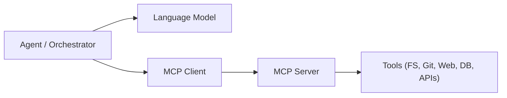
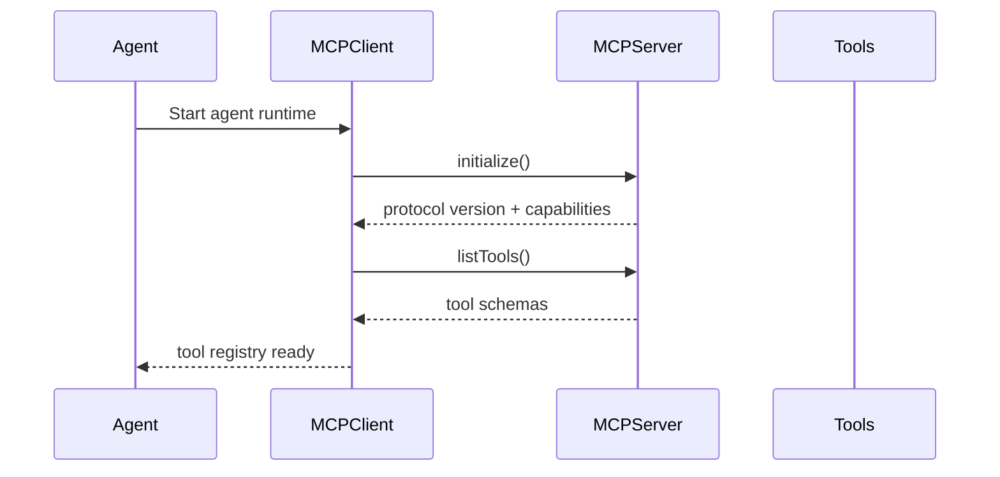
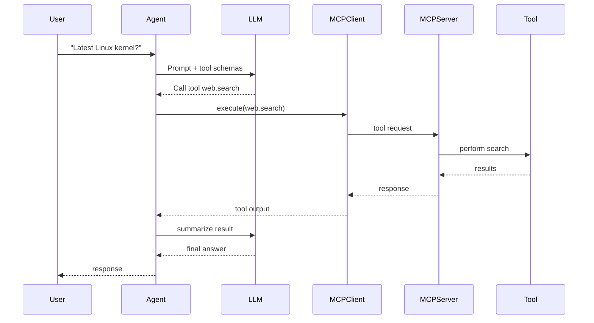
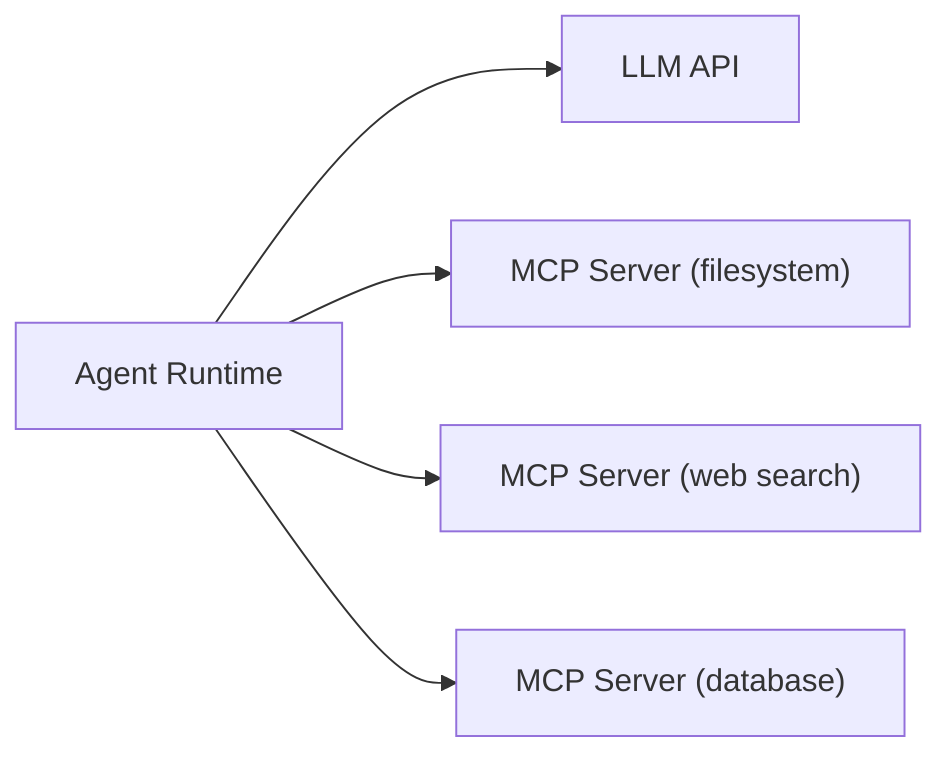

## MCP (Model Context Protocol)

Many modern agent frameworks integrate **MCP (Model Context Protocol)** to standardize how agents interact with external tools, memory providers, and services.
Instead of embedding tool logic directly in the agent runtime, MCP introduces a **separate tool server layer** with a well-defined protocol.
This separation improves modularity, portability, and security: tools can run in isolated processes or even on remote machines while the agent interacts with them through a consistent interface.

---

## Component Overview

An MCP-based architecture separates responsibilities into three main components.



**Components**

**Agent / Orchestrator**

* Main runtime controlling the workflow
* Sends prompts to the LLM
* Decides when to call tools
* Maintains memory/context

**LLM**

* Provides reasoning and planning
* Suggests tool usage
* Generates structured tool calls

**MCP Client**

* Library embedded in the agent
* Implements the MCP protocol
* Handles discovery of tools and execution requests

**MCP Server**

* External process exposing tools via MCP
* Can run locally or remotely
* Registers available tools and their schemas

**Tools**

* Actual capabilities (filesystem, git, APIs, databases, shell commands, etc.)
* Implemented behind the MCP server

Key idea: **agents never call tools directly — they communicate with an MCP server through the protocol.**

---

## MCP Handshake / Initialization

Before an agent can execute tools, the MCP client and server perform a short initialization handshake.



**Step-by-step**

1. **Agent startup**

   * Agent initializes the MCP client.
   * MCP client connects to the MCP server (usually via stdio, HTTP, or WebSocket).

2. **Protocol initialization**

   * Client sends `initialize` request.
   * Server responds with protocol version and capabilities.

3. **Tool discovery**

   * Client requests `listTools`.
   * Server returns all registered tools with metadata.

4. **Schema registration**

   * Each tool includes:

     * name
     * description
     * JSON input schema
     * expected output

5. **Tool registry ready**

   * Agent now knows which tools exist and how to call them.
   * The tool schemas are injected into the LLM context.

This step is crucial because it allows **dynamic tool discovery**.
Agents can connect to new MCP servers and immediately gain new capabilities.

---

## Example Workflow

The following example shows how an agent performs a web search using MCP.

### Step 1 — User request

```
User: "Find the latest Linux kernel version."
```

### Step 2 — Agent planning

The agent sends the request to the LLM along with the available MCP tools.

Example tools discovered earlier:

```
web.search
git.clone
filesystem.read
database.query
```

The LLM decides that **web.search** is required.

### Step 3 — Tool invocation via MCP



### Step 4 — Tool execution

Example MCP request:

```
tool: web.search
input:
  query: "latest Linux kernel version"
```

Server executes the tool and returns structured output:

```
{
  "version": "6.9",
  "release_date": "2024-05"
}
```

### Step 5 — Response synthesis

The agent sends the tool output back to the LLM and asks it to generate a final answer.

Result returned to the user:

```
The latest stable Linux kernel version is 6.9.
```

---

## Advantages of MCP

**Standardization**

All tools follow the same protocol regardless of language or environment.

**Tool portability**

Tools can be reused across many agents and frameworks.

**Isolation**

Tools run in separate processes or containers.

**Dynamic capability discovery**

Agents can attach to new MCP servers at runtime.

**Language-agnostic**

MCP servers can be written in Rust, Go, Python, Node, etc.

---

## Typical MCP Deployment



In larger systems multiple MCP servers may run simultaneously:

* **filesystem MCP server**
* **git MCP server**
* **web search MCP server**
* **database MCP server**

Agents simply connect to all of them and merge the tool registry.

---

## Summary

MCP introduces a **clean separation between agents and tools**.

Instead of embedding tool logic directly into the agent runtime, MCP provides:

* a **tool discovery protocol**
* a **standard execution interface**
* a **modular tool ecosystem**

This allows agent frameworks to remain lightweight while gaining powerful capabilities through external MCP servers.
