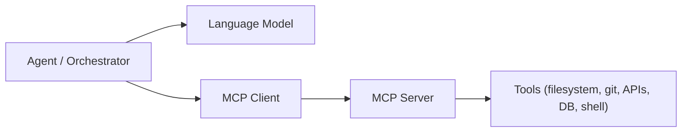
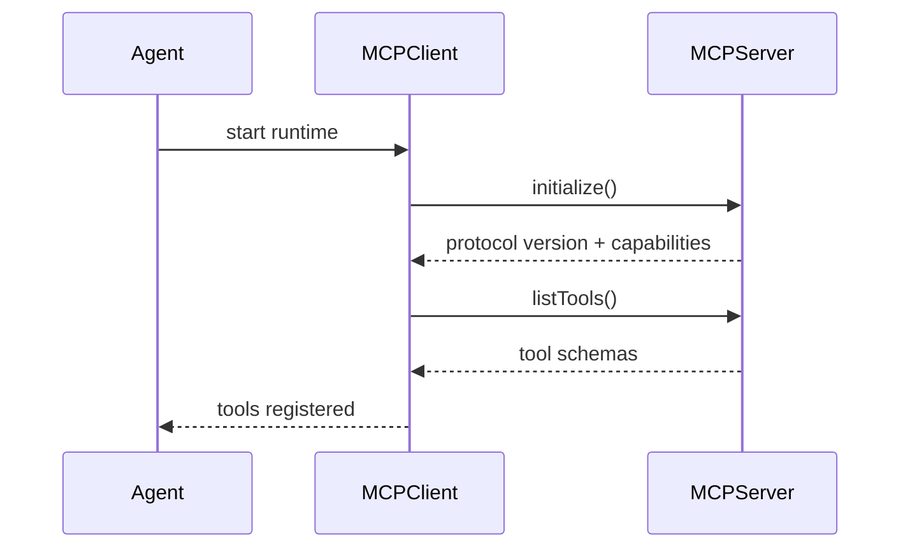
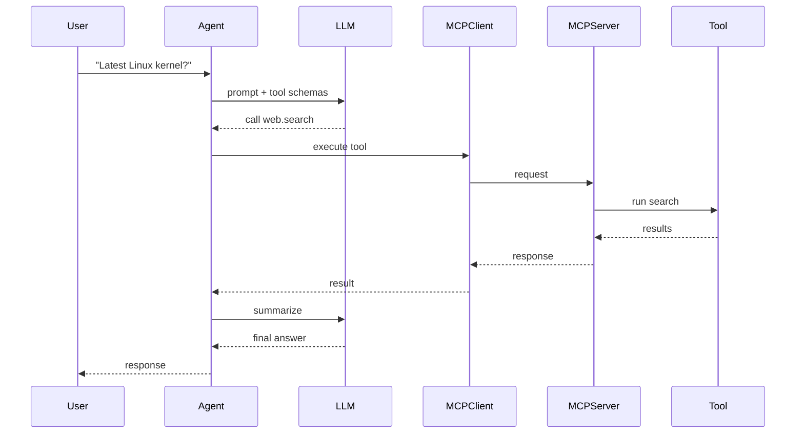
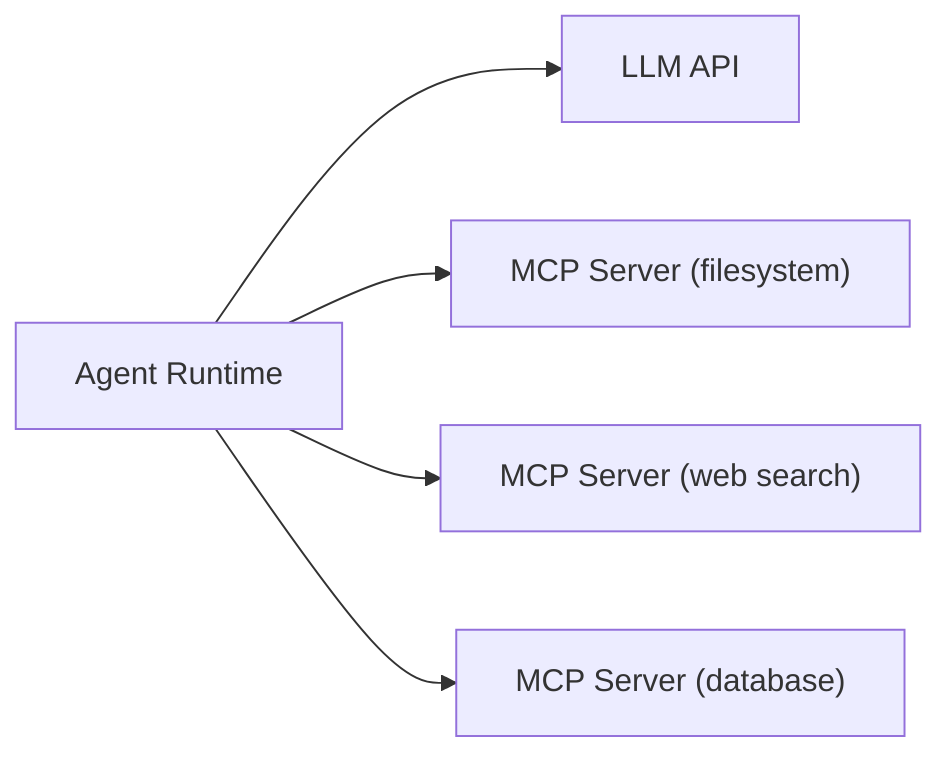

## MCP (Model Context Protocol)

Modern agent frameworks increasingly use **MCP (Model Context Protocol)** to standardize how AI agents interact with external tools, memory systems, and APIs. Instead of embedding tool logic directly inside the agent runtime, MCP introduces a **separate tool server layer** that exposes capabilities via a common protocol.

The protocol acts like a universal interface between **LLMs and external systems**, enabling agents to access files, APIs, databases, or automation scripts in a consistent way. MCP was introduced as an open standard in 2024 to simplify tool integration across AI applications. ([Google Cloud][1])

---

# MCP Architecture

## Component Overview

An MCP-based architecture separates the reasoning system (LLM) from the tool execution layer.



### Agent / Orchestrator

The runtime managing the assistant.

Responsibilities:

* receive user input
* maintain context and memory
* decide when to call tools
* coordinate the LLM and MCP client

### LLM

The reasoning component.

It:

* interprets user intent
* selects tools when necessary
* generates structured tool calls

### MCP Client

Library integrated in the agent.

Functions:

* communicates with MCP servers
* performs tool discovery
* executes tool requests

### MCP Server

External process exposing capabilities through MCP.

Typical examples:

* filesystem server
* git server
* web search server
* database server

### Tools

Actual implementations that perform real work.

Examples:

* read file
* run shell command
* fetch API data
* query database

Important principle:

**Agents never call tools directly — they communicate through the MCP protocol.**

---

# MCP Initialization / Handshake

Before tools can be used, the MCP client and server negotiate capabilities.



### Initialization Steps

**1. Agent startup**

The agent launches its MCP client and connects to one or more MCP servers (via stdio, HTTP, or WebSocket).

**2. Protocol negotiation**

The client sends:

```
initialize
```

The server returns:

* protocol version
* supported features

MCP is a **stateful protocol**, meaning both sides negotiate capabilities during initialization. ([Model Context Protocol][2])

**3. Tool discovery**

The client requests:

```
listTools
```

The server responds with a list of tools and their metadata.

**4. Schema registration**

Each tool provides:

* name
* description
* JSON input schema
* expected output

**5. Tool registry ready**

The agent injects these tool schemas into the LLM prompt context.

This enables **dynamic tool discovery** — agents can connect to new MCP servers and automatically gain new capabilities.

---

# Example MCP Workflow

Example task:

```
User: "Find the latest Linux kernel version."
```

### Step 1 — Agent reasoning

The agent sends the request to the LLM along with available MCP tools.

Example tool registry:

```
web.search
filesystem.read
git.clone
database.query
```

The LLM decides to use **web.search**.

---

### Step 2 — Tool invocation



Example MCP request:

```
tool: web.search
input:
  query: "latest Linux kernel version"
```

Example response:

```
{
  "version": "6.9",
  "release_date": "2024-05"
}
```

The agent sends this back to the LLM to generate a human-readable answer.

---

# LLM Support for MCP

A critical detail: **MCP is not implemented directly inside LLMs.**

Instead, the **agent runtime implements MCP**, while the LLM must support **structured tool calling**.

Therefore, only models capable of **function calling / tool use** can effectively work with MCP.

Typical requirements:

* structured JSON tool calls
* reliable reasoning for tool selection
* multi-step reasoning
* large context window

Without these capabilities, the model cannot reliably interact with MCP servers.

---

## Common LLMs used with MCP

### Claude models

Anthropic created MCP and Claude is the primary reference implementation.

Used in:

* Claude Desktop
* Cursor IDE
* MCP developer tooling

### OpenAI GPT models

GPT-4 and GPT-4o can use MCP through agent runtimes and adapters.

Example frameworks:

* OpenAI Agents SDK
* LangChain MCP adapters

These models support structured tool calls required by MCP. ([LangChain Docs][3])

### Google Gemini

Gemini can interact with MCP through bridge SDKs and agent frameworks. ([DaveAI][4])

### Local models (via agent frameworks)

Local models can also use MCP if the framework translates tool calls correctly.

Typical setups:

* Ollama + MCP client
* LangChain agents
* AutoGen agents

---

## Qwen 3.5 and MCP

The **Qwen 3.5 series** (Alibaba) is increasingly used in autonomous agents because of its strong tool-calling and reasoning capabilities.

Relevant properties:

* advanced **function calling support**
* strong **multi-step reasoning**
* good **JSON structured output reliability**
* large context windows (depending on model variant)

These capabilities make Qwen-3.5 suitable for MCP-based agents when used with frameworks like:

* OpenAI-compatible APIs
* Ollama
* vLLM runtimes
* LangChain / LlamaIndex agents

Typical deployments:

```
Agent runtime
     |
     | MCP client
     |
Qwen-3.5 model
     |
MCP servers (tools)
```

Because MCP itself is **model-agnostic**, any LLM capable of reliable structured tool calls can be integrated.

---

# Typical MCP Deployment

Large agent systems often run multiple MCP servers simultaneously.



Examples of MCP servers:

* filesystem access
* git operations
* browser automation
* database queries
* cloud APIs

Agents automatically merge all available tools into one registry.

---

# Summary

MCP introduces a **standardized interface between LLM agents and external tools**.

Key characteristics:

* open protocol for tool integration
* client-server architecture
* dynamic tool discovery
* language-agnostic tool servers
* compatible with many LLMs

However, only **LLMs capable of structured tool calling** can reliably use MCP.

Examples include:

* Claude models
* GPT-4 / GPT-4o
* Gemini
* modern open models such as **Qwen-3.5**

With MCP, agent frameworks can remain lightweight while gaining powerful capabilities through tool servers.

[1]: https://cloud.google.com/discover/what-is-model-context-protocol "What is Model Context Protocol (MCP)? A guide"
[2]: https://modelcontextprotocol.io/docs/learn/architecture "Architecture overview"
[3]: https://docs.langchain.com/oss/python/langchain/mcp "Model Context Protocol (MCP) - Docs by LangChain"
[4]: https://www.iamdave.ai/blog/top-10-model-context-protocol-use-cases-complete-guide-for-2025/ "Top 10 Model Context Protocol Use Cases"
