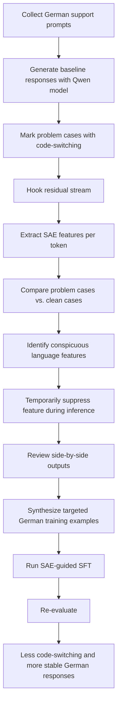

# Qwen Scope

## Executive Summary

Qwen Scope is not another chat client, but an open-source interpretability suite for the Qwen3 and Qwen3.5 families. Qwen officially positions the release as a bridge from post-hoc analysis to real development workflows across four areas: inference control, evaluation, data work, and post-training. The official collection includes 14 SAE groups across seven backbones; pricing, dedicated enterprise features, and a clearly described managed product model are not specified in the reviewed Scope sources.

Strategically, Qwen Scope is interesting because it not only makes internal model features visible, but turns them into a controllable development interface: for feature steering without weight changes, benchmark analysis without full evaluation runs, targeted data synthesis, and fixing low-frequency errors such as code-switching or repetition. The tech press also reads the launch in exactly this direction: as a step from interpretability toward practical development tools.

## Product in Brief

Qwen Scope is an open-source suite of Sparse Autoencoders for Qwen3 and Qwen3.5 models. The SAEs are connected to hidden model states or the residual stream and decompose dense activations into sparse, more interpretable features that can be used directly for steering, diagnostics, benchmark analysis, and training.

The official artifacts are provided as a collection and model cards via Hugging Face. An example 27B artifact shows how concrete this is: residual-stream hook, coverage of all 64 layers, SAE width 81,920, and Top-K 50.

## Key Capabilities and Differentiators

Qwen Scope is especially relevant because Qwen does not publish the SAEs as an academic byproduct, but structures them around clear developer workflows. The most important points:

* **Broad family coverage instead of a single-model demo:** The official collection covers seven Qwen3/Qwen3.5 backbones, including dense and MoE models, and lists 14 SAE groups for them.
* **Four operational usage axes:** Qwen explicitly names inference, evaluation, data, and training as the suite’s core areas.
* **Feature steering without weight updates:** According to the technical report, language, concepts, and preferences can be controlled through feature interventions without changing the model weights.
* **Evaluation at the representation level:** Activated SAE features serve as a compact fingerprint signal for what a benchmark is actually testing.
* **Data-centric work instead of mere model inspection:** Qwen explicitly describes data classification and data synthesis as application scenarios; the official X post additionally emphasizes targeted data work with minimal seed examples.
* **Direct connection to post-training:** Official materials mention code-switching and repetitive generation as low-quality issues that can be analyzed and addressed through SAE signals.

## What Qwen Scope Newly Enables

The real leap is not the existence of SAEs as such, but their operationalization as a development interface. This enables things that previously were usually only practical through coarse retraining, heuristic prompt construction, or not at all.

* **Surgical debugging instead of broad corrections:** In the report, Qwen shows a case where an English prompt unexpectedly mixes in Chinese text; by ranking the activated features, the responsible Chinese-language feature is identified and suppressed during inference. Result: the language mixing disappears without changing model weights.
* **Controlled style shifting instead of mere prompt rhetoric:** A second official example activates a classical Chinese feature and shifts a modern Chinese continuation into a literary classical style while preserving the semantic direction. This is qualitatively different from “please write more formally.”
* **Benchmark analysis without full benchmarking:** Qwen uses activated features as a benchmark’s “micro-capability fingerprint.” Across 17 benchmarks, the correlation between performance-based and feature-based redundancy was around 0.85 — strong enough to curate benchmarks more intelligently and detect redundancy earlier.
* **Targeted long-tail safety data instead of broad random collection:** In data synthesis, feature-driven synthesis reportedly achieves 99.74 percent target-feature coverage and, with a total of 8k safety examples, approaches the effect of a 120k safety-only setting. That is a very strong signal for more efficient long-tail coverage.
* **Targeted post-training against rare failure patterns:** For code-switching, the report states a reduction of more than 50 percent compared with baselines. This turns interpretability not only into a diagnostic instrument, but into an optimization tool.

The governance perspective is important: in the official artifacts, Qwen explicitly prohibits the misuse of interpretable interventions to harmfully interfere with model capabilities or generate harmful content. This underlines how powerful this interface can be.

## Practical Example

A good, everyday use case for LinkedIn is **“reducing unwanted code-switching in a German-language support assistant.”** It is concrete, technically traceable, and directly based on the official Qwen Scope workflows for feature extraction, data work, and SFT.

1. **Select the appropriate model and SAE.**
   Load the base model and the corresponding SAE repo, for example `Qwen/Qwen3.5-27B` plus `Qwen/SAE-Res-Qwen3.5-27B-W80K-L0_50`.
   **Expected output:** a set of `layer{n}.sae.pt` checkpoints for all layers and a defined hook point in the residual stream.

2. **Run a baseline prompt set from the real support context.**
   Use 50–200 representative German service prompts and mark responses where the output suddenly switches to English, Chinese, or mixed language.
   **Expected output:** a small, curated set of “clean” and “problematic” responses.

3. **Hook residual states and extract feature activations.**
   Register a forward hook on the target layer and calculate the active SAE features per token, as outlined in the model card.
   **Expected output:** feature IDs, activation values, and token positions for each problematic response.

4. **Compare problematic cases against clean cases.**
   Compare the activated features from the code-switching cases with the clean German responses and identify language features that fire disproportionately in the problematic cases.
   **Expected output:** a prioritized list of suspicious language and style features.

5. **Run quick validation via inference steering.**
   Temporarily suppress the conspicuous language feature during generation and compare baseline vs. steered output side by side.
   **Expected output:** less language mixing without having to fine-tune the model yet.

6. **Build targeted data synthesis for post-training.**
   Generate additional clean German support examples aligned with the desired feature signature and use them for SAE-guided SFT.
   **Expected output:** a compact, targeted fine-tuning set instead of a broadly scattered example collection.

7. **Re-evaluate.**
   Measure the same prompts again and check the code-switching rate as well as general response quality.
   **Expected output:** reduced language mixing with largely preserved core capabilities; in the official report, the reduction in code-switching was above 50 percent.

The process can be visualized as follows. The logic follows directly from the official workflows for inference, data, and SFT.

## Comparison with Similar Tools

The closest comparison points are Gemma Scope 2 from the Google DeepMind ecosystem and the Neuronpedia platform. Important: Qwen Scope sits somewhat between a “family-specific interpretability suite” and an “operational development interface.”

| Tool              | Core strengths                                                                                                                                                  | Limits                                                                                                                                                               |
| ----------------- | --------------------------------------------------------------------------------------------------------------------------------------------------------------- | -------------------------------------------------------------------------------------------------------------------------------------------------------------------- |
| **Qwen Scope**    | Family-specific SAE suite for Qwen3/Qwen3.5; covers steering, evaluation, data, and training; 14 SAE groups across 7 backbones, including dense and MoE models. | Strongly focused on the Qwen family; pricing, SLA, enterprise governance, and managed features are not specified in the reviewed Scope sources.                      |
| **Gemma Scope 2** | Comprehensive open suite of SAEs and transcoders for Gemma 3; focus on layer analysis, safety debugging, hallucinations, jailbreaks, and faithfulness.          | Also family-specific; positioned more strongly as a safety and research toolkit than as a general development workflow spanning data, evaluation, and post-training. |
| **Neuronpedia**   | Open platform for searching, visualizing, and steering internal model features; supports feature dashboards and text-to-feature search on arbitrary inputs.     | More platform/UI than official weight release for a model family; value depends on available SAE sets, datasets, and imports.                                        |

If you are looking for a library rather than a suite or platform, SAE Lens from the Decode Research ecosystem is relevant: training, analysis, and dashboards for SAEs, including support for arbitrary PyTorch models. The caveat: this is a research toolkit, not a preconfigured Qwen-specific product package.

## LinkedIn Building Blocks

**Recommended LinkedIn Post Structure**

* **Hook:** Interpretability is moving from research to development tooling.
* **Problem:** Until now, LLMs were often difficult to debug, benchmark, and fine-tune in a targeted way.
* **Product core:** Qwen Scope as an open-source SAE suite for Qwen3/Qwen3.5.
* **Three core messages:** Steering without weight updates, evaluation via feature fingerprints, targeted data synthesis/post-training.
* **One concrete example:** Reducing code-switching in a German-language assistant.
* **Closing:** Why this matters for teams working with open models and what is not yet specified.

**Suggested Hook**

> Interpretability was long a research topic. Qwen Scope is interesting because it turns interpretability into a developer tool: internal model features become control levers for steering, evaluation, data work, and post-training.
> For teams working productively with open models, this is potentially more important than the next pure benchmark jump.

**Suggested CTA**

> If you work with open models, Qwen Scope is worth looking at less as a “cool demo” and more as a new debugging and training layer. I’d be interested to hear: would you use something like this more for inference steering, evaluation, or targeted data synthesis?

**Draft LinkedIn Blog Post**

In practice, interpretability was often something for research teams. Qwen Scope now shifts the topic toward development tooling: Qwen is releasing an open-source suite of Sparse Autoencoders for Qwen3 and Qwen3.5 models and connecting it directly to four workflows — inference, evaluation, data, and training. This is exciting because internal model states are no longer merely visible; they become operationally usable.

The core difference compared with many earlier interpretability releases: Qwen Scope does not stop at post-hoc analysis. According to the official report, language, concepts, and preferences can be steered through feature interventions without changing the model weights. At the same time, activated features can serve as fingerprints for benchmarks, making it possible to assess redundancy and capability coverage more intelligently.

The concrete examples are strong: the report shows a case where an English response unexpectedly mixes in Chinese text; the responsible language feature is identified and suppressed during inference. In a second case, an activated classical Chinese feature shifts the style of a continuation toward literary Chinese while preserving meaning. That is much more precise than conventional prompt tuning.

I find the data- and training-centric side even more interesting: according to the report, feature-driven safety synthesis achieves 99.74 percent target-feature coverage and, with 8k safety examples, approaches the effect of a 120k safety-only setting. For code-switching, Qwen also reports a reduction of more than 50 percent. This is exactly the point where interpretability does not just explain, but improves.

For teams on LinkedIn, my takeaway is therefore: Qwen Scope is less “yet another open-source release” and more a signal that feature-level control is moving into the toolkit of productive LLM development. What is currently still missing, however, are clearly described pricing, enterprise SLAs, and governance features — these are not specified in the reviewed Scope sources.

## Visual Recommendations and Open Points

For a strong LinkedIn post, I would not recommend generic product images, but three clear content-driven visuals:

* **Type:** 2×2 capability matrix
  **Caption:** “Qwen Scope shifts interpretability from analysis to four operational workflows: inference, evaluation, data, training.”
* **Type:** Architecture diagram
  **Caption:** “From prompt through the residual stream to an interpretable feature — and back into steering or training.”
* **Type:** Before/after comparison
  **Caption:** “Feature steering corrects language mixing or changes style without changing model weights.”
* **Type:** Coverage chart
  **Caption:** “Feature-driven synthesis achieves near-complete coverage of safety-relevant target features at a small budget.”

Open or **not specified** in the reviewed Qwen Scope sources are: pricing, dedicated enterprise SKU, SLA/support model, SSO/RBAC, audit logs, compliance features, and a clearly described managed deployment specifically for Qwen Scope. For LinkedIn, this matters because you should frame the post cleanly as an **open-source interpretability suite with practical workflows** — not as a fully described enterprise product.
