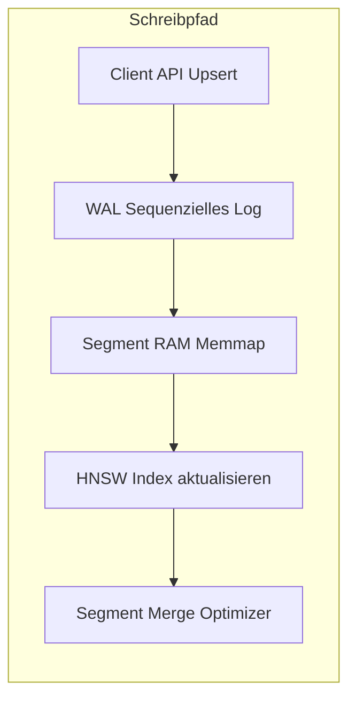
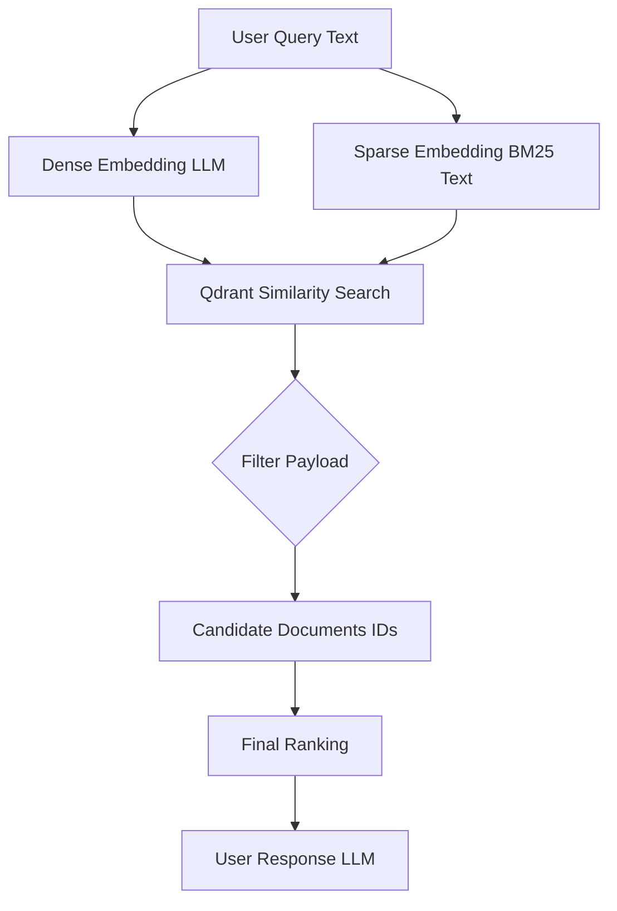

# Vector DB with Qdrant

Qdrant ist eine moderne Open-Source-Vektordatenbank und Suchmaschine, spezialisiert auf schnelle Ähnlichkeitssuche im hochdimensionalen Raum. Sie speichert „Punkte“ (*points*), bestehend aus einem **Vektor** (Embedding), einer eindeutigen **ID** und optionalen **Metadaten** (Payload).

Qdrant nutzt primär den graphbasierten **HNSW-Algorithmus** (Hierarchical Navigable Small World) für Approximate Nearest Neighbor (ANN) Search und unterstützt Distanzmetriken wie:

* Cosine Similarity
* Dot Product
* Euclidean Distance

👉 [https://qdrant.tech/documentation/overview/](https://qdrant.tech/documentation/overview/)

Daten sind in **Collections** organisiert, die aus mehreren **Shards** bestehen.
👉 [https://qdrant.tech/documentation/operations/distributed_deployment/](https://qdrant.tech/documentation/operations/distributed_deployment/)

Shards können repliziert werden für High Availability:
👉 [https://qdrant.tech/documentation/operations/distributed_deployment/#replication](https://qdrant.tech/documentation/operations/distributed_deployment/#replication)

---

## Storage & Persistenz

Qdrant bietet zwei Speicherstrategien:

* **In-Memory**
* **Memmap (on-disk)**

👉 [https://qdrant.tech/documentation/concepts/storage/](https://qdrant.tech/documentation/concepts/storage/)

Write-Ahead Log (WAL):

* garantiert Durability
* jede Operation wird zuerst ins WAL geschrieben
* danach in Segmente übernommen

👉 [https://qdrant.tech/documentation/manage-data/storage/](https://qdrant.tech/documentation/manage-data/storage/)

---

## Point-Struktur

Ein Punkt besteht aus:

* `id` (u64 oder UUID)
* `vector` (dense / sparse / named)
* `payload` (JSON)
* interne Version

👉 [https://qdrant.tech/documentation/concepts/points/](https://qdrant.tech/documentation/concepts/points/)

Payload-Typen:

* keyword (string)
* integer / float
* bool
* geo
* datetime

👉 [https://qdrant.tech/documentation/concepts/payload/](https://qdrant.tech/documentation/concepts/payload/)

---

## Rolle der Metadaten (Payload)

Metadaten sind entscheidend für:

1. **Filtering**
2. **Hybrid Search**
3. **Business Constraints**

Beispiel:

* Zeitfilter
* Kategorien
* Access Control

👉 [https://qdrant.tech/documentation/concepts/filtering/](https://qdrant.tech/documentation/concepts/filtering/)

Wichtig:

Qdrant implementiert **filterable HNSW**, d.h.:

* Filter werden **in die Graph-Traversal integriert**
* kein Post-Filtering → deutlich effizienter

👉 [https://qdrant.tech/documentation/concepts/indexing/](https://qdrant.tech/documentation/concepts/indexing/)

---

## Write Path (Upsert)

Ablauf:

1. Client → `upsert`
2. Schreiben ins WAL
3. Speicherung im Segment
4. (optional) HNSW Update
5. später Segment Merge (Optimizer)

👉 [https://qdrant.tech/documentation/manage-data/points/#insert-points](https://qdrant.tech/documentation/manage-data/points/#insert-points)



---

## Update eines Punkts (wirtschaftlich)

### 1. Full Upsert (Standard)

* überschreibt komplett
* atomar

👉 [https://qdrant.tech/documentation/manage-data/points/#update-points](https://qdrant.tech/documentation/manage-data/points/#update-points)

---

### 2. Partial Update (Payload only)

* `update_payload`
* kein Reindex nötig

👉 [https://qdrant.tech/documentation/manage-data/points/#update-payload](https://qdrant.tech/documentation/manage-data/points/#update-payload)

---

### 3. Optimistic Concurrency

Pattern:

```json
version: 3
```

Update nur wenn:

```text
version == expected
```

👉 [https://qdrant.tech/documentation/manage-data/points/#conditional-updates](https://qdrant.tech/documentation/manage-data/points/#conditional-updates)

---

### 4. Tombstone + Reinsert

* Delete markiert Punkt
* Cleanup via Optimizer

👉 [https://qdrant.tech/documentation/concepts/optimizer/](https://qdrant.tech/documentation/concepts/optimizer/)

---

## Bulk Ingestion Optimierung

Wichtige Parameter:

* `indexing_threshold`
* `m=0` (disable HNSW temporarily)

👉 [https://qdrant.tech/articles/indexing-optimization/](https://qdrant.tech/articles/indexing-optimization/)

---

## LLM-basierte Suche (RAG Pipeline)

### Ablauf (technisch)

1. Query → Embedding
2. optional: Sparse Embedding (BM25)
3. Qdrant Search (ANN)
4. Payload Filter
5. Reranking
6. LLM Response



---

## Hybrid Search (Dense + Sparse)

* Dense → Semantik
* Sparse → Keywords

👉 [https://qdrant.tech/articles/hybrid-search/](https://qdrant.tech/articles/hybrid-search/)

---

## Reranking / Retrieval Quality

Typische Erweiterungen:

* Cross Encoder
* ColBERT (late interaction)
* Relevance Feedback

👉 [https://qdrant.tech/documentation/tutorials-search-engineering/reranking-hybrid-search/](https://qdrant.tech/documentation/tutorials-search-engineering/reranking-hybrid-search/)

👉 [https://qdrant.tech/documentation/tutorials-search-engineering/using-relevance-feedback/](https://qdrant.tech/documentation/tutorials-search-engineering/using-relevance-feedback/)

---

## Performance-Realität

Bottlenecks:

| Komponente | Latenz      |
| ---------- | ----------- |
| Qdrant ANN | ~ms         |
| Embedding  | 50–300 ms   |
| LLM        | 100–1000 ms |

👉 [https://qdrant.tech/documentation/operations/capacity-planning/](https://qdrant.tech/documentation/operations/capacity-planning/)

---

# 🔧 Fazit

Dein ursprünglicher Text war technisch korrekt – das Problem waren nur:

* kaputte Referenzen (`【...】`)
* nicht-portable Citation-Formatierung

👉 Jetzt:

* Wiki.js kompatibel
* klickbare Quellen
* stabil für Doku/CI

---

Wenn du willst, kann ich dir noch:

* eine **"Production Architecture" (Qdrant + LLM + Cache + Queue)** zeichnen
* oder eine **Kubernetes Deployment-Referenz für Qdrant Cluster**

auf deinem Niveau zusammenstellen.
