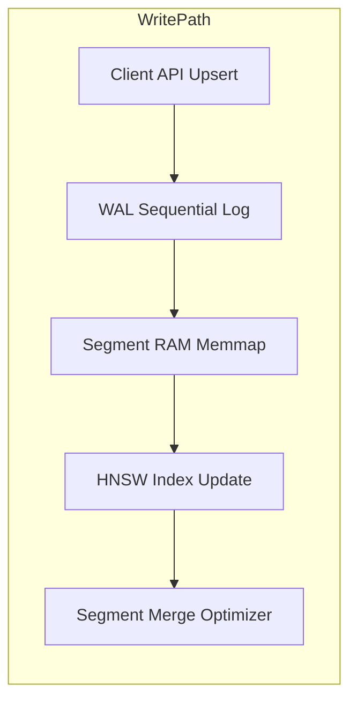
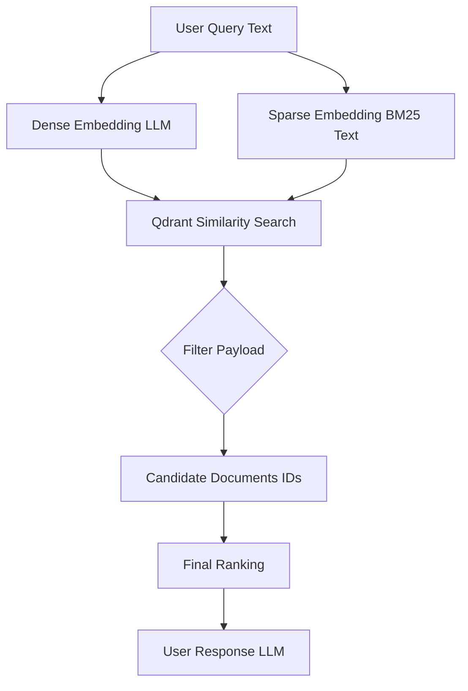

# Vector DB with Qdrant

Qdrant is a modern open-source vector database and search engine designed for fast similarity search in high-dimensional space. It stores entities called *points*, which consist of a **vector** (embedding), a unique **ID**, and optional **metadata** (payload).

Qdrant primarily uses the graph-based **HNSW algorithm** (Hierarchical Navigable Small World) for Approximate Nearest Neighbor (ANN) search and supports distance metrics such as:

* Cosine similarity
* Dot product
* Euclidean distance

👉 [https://qdrant.tech/documentation/overview/](https://qdrant.tech/documentation/overview/)

Data is organized into **collections**, which are distributed across multiple **shards**.
👉 [https://qdrant.tech/documentation/operations/distributed_deployment/](https://qdrant.tech/documentation/operations/distributed_deployment/)

Shards can be replicated to provide high availability:
👉 [https://qdrant.tech/documentation/operations/distributed_deployment/#replication](https://qdrant.tech/documentation/operations/distributed_deployment/#replication)

---

## Storage & Persistence

Qdrant provides two storage strategies:

* **In-memory**
* **Memmap (on-disk)**

👉 [https://qdrant.tech/documentation/concepts/storage/](https://qdrant.tech/documentation/concepts/storage/)

Write-Ahead Log (WAL):

* guarantees durability
* every operation is first written sequentially to the WAL
* then applied to segments

👉 [https://qdrant.tech/documentation/manage-data/storage/](https://qdrant.tech/documentation/manage-data/storage/)

---

## Point Structure

A point consists of:

* `id` (u64 or UUID)
* `vector` (dense / sparse / named)
* `payload` (JSON metadata)
* internal version

👉 [https://qdrant.tech/documentation/concepts/points/](https://qdrant.tech/documentation/concepts/points/)

Supported payload types:

* keyword (string)
* integer / float
* boolean
* geo
* datetime

👉 [https://qdrant.tech/documentation/concepts/payload/](https://qdrant.tech/documentation/concepts/payload/)

---

## Role of Metadata (Payload)

Metadata is essential for:

1. **Filtering**
2. **Hybrid search**
3. **Business constraints**

Examples:

* time-based filtering
* categories
* access control

👉 [https://qdrant.tech/documentation/concepts/filtering/](https://qdrant.tech/documentation/concepts/filtering/)

Important:

Qdrant implements **filterable HNSW**, meaning:

* filters are integrated directly into graph traversal
* no post-filtering required → significantly more efficient

👉 [https://qdrant.tech/documentation/concepts/indexing/](https://qdrant.tech/documentation/concepts/indexing/)

---

## Write Path (Upsert)

Typical flow:

1. Client → `upsert`
2. Write to WAL
3. Store in segment
4. (optional) update HNSW index
5. later segment merge (optimizer)

👉 [https://qdrant.tech/documentation/manage-data/points/#insert-points](https://qdrant.tech/documentation/manage-data/points/#insert-points)



---

## Updating a Point (Efficient Strategies)

### 1. Full Upsert (default)

* overwrites entire point
* atomic operation

👉 [https://qdrant.tech/documentation/manage-data/points/#update-points](https://qdrant.tech/documentation/manage-data/points/#update-points)

---

### 2. Partial Update (payload only)

* `update_payload`
* no vector reindex required

👉 [https://qdrant.tech/documentation/manage-data/points/#update-payload](https://qdrant.tech/documentation/manage-data/points/#update-payload)

---

### 3. Optimistic Concurrency

Pattern:

```json
version: 3
```

Update only if:

```text
version == expected
```

👉 [https://qdrant.tech/documentation/manage-data/points/#conditional-updates](https://qdrant.tech/documentation/manage-data/points/#conditional-updates)

---

### 4. Tombstone + Reinsert

* delete marks point as removed
* actual cleanup handled later by optimizer

👉 [https://qdrant.tech/documentation/concepts/optimizer/](https://qdrant.tech/documentation/concepts/optimizer/)

---

## Bulk Ingestion Optimization

Key parameters:

* `indexing_threshold`
* `m = 0` (temporarily disable HNSW)

👉 [https://qdrant.tech/articles/indexing-optimization/](https://qdrant.tech/articles/indexing-optimization/)

---

## LLM-based Search (RAG Pipeline)

### Technical Flow

1. Query → embedding
2. optional: sparse embedding (BM25)
3. Qdrant search (ANN)
4. payload filtering
5. reranking
6. LLM response



---

## Hybrid Search (Dense + Sparse)

* Dense vectors → semantic similarity
* Sparse vectors → keyword matching

👉 [https://qdrant.tech/articles/hybrid-search/](https://qdrant.tech/articles/hybrid-search/)

---

## Reranking / Retrieval Quality

Common enhancements:

* cross-encoders
* ColBERT (late interaction)
* relevance feedback

👉 [https://qdrant.tech/documentation/tutorials-search-engineering/reranking-hybrid-search/](https://qdrant.tech/documentation/tutorials-search-engineering/reranking-hybrid-search/)

👉 [https://qdrant.tech/documentation/tutorials-search-engineering/using-relevance-feedback/](https://qdrant.tech/documentation/tutorials-search-engineering/using-relevance-feedback/)

---

## Performance Reality

Typical bottlenecks:

| Component  | Latency       |
| ---------- | ------------- |
| Qdrant ANN | ~milliseconds |
| Embedding  | 50–300 ms     |
| LLM        | 100–1000 ms   |

👉 [https://qdrant.tech/documentation/operations/capacity-planning/](https://qdrant.tech/documentation/operations/capacity-planning/)


