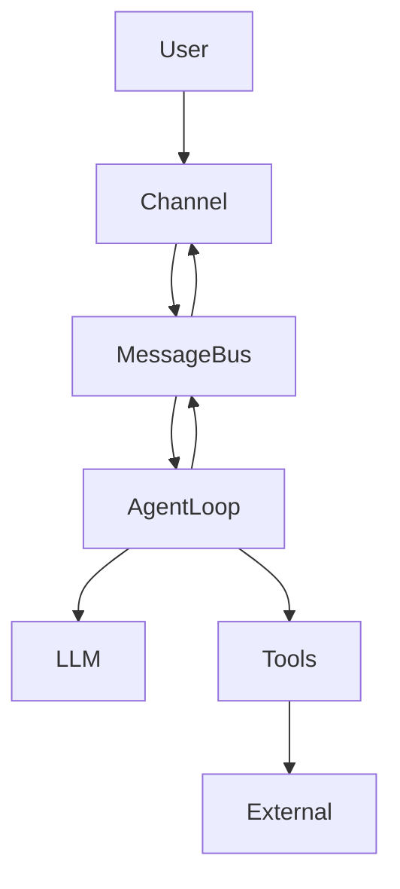
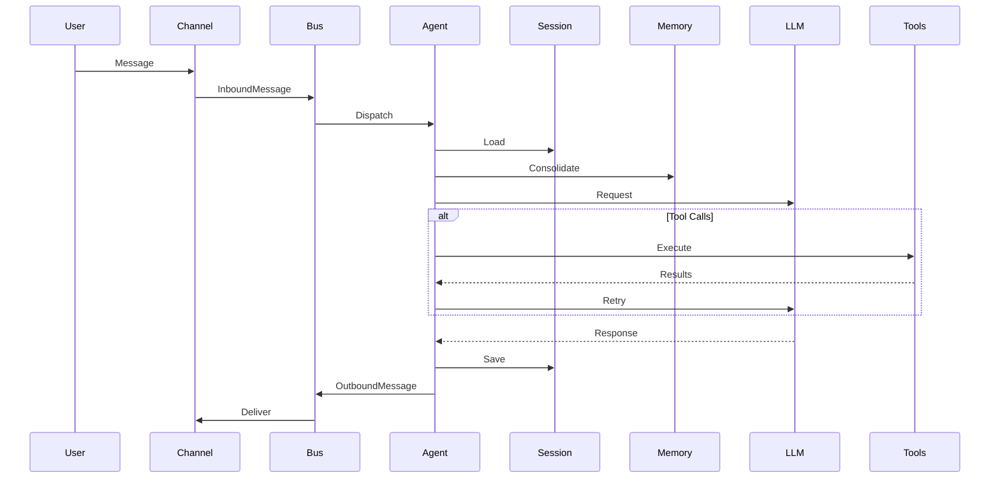

# Nanobot Architecture & Execution Model

# Executive Summary

Nanobot is a lightweight, Python-based local AI assistant framework inspired by OpenClaw. It initializes from a JSON configuration file (default: `~/.nanobot/config.json`) and sets up a dedicated workspace (`~/.nanobot/workspace`).

On startup, Nanobot initializes several core subsystems:

* **MessageBus** – internal event routing
* **ChannelManager** – integrations (CLI, Slack, Telegram, etc.)
* **SessionManager** – persistent conversation tracking
* **CronService** – scheduled task execution
* **HeartbeatService** – periodic agent triggers

It also populates the workspace with bootstrap files:

* `AGENTS.md`
* `SOUL.md`
* `USER.md`
* `HEARTBEAT.md`
* `memory/`

These define agent identity, behavioral constraints, and long-term memory.

---

## Runtime Behavior

Incoming messages flow through:

```
User → Channel → MessageBus → AgentLoop → LLM → Tools → Response
```

The **AgentLoop** constructs a full execution context consisting of:

* System prompts (bootstrap files)
* Long-term memory (`memory/*.md`)
* Session history (`sessions/*.jsonl`)

The LLM is invoked with this context. If tool calls are generated (e.g., shell, web search), they are executed and the results are fed back into the loop until completion.

---

## Security Model

Nanobot enforces runtime safety through configuration:

* `tools.restrictToWorkspace=true`
  → confines all filesystem and shell operations

* Channel access control via `allowFrom` whitelist

* Secrets stored in `config.json` with strict permissions

* Sessions stored locally under:

  ```
  workspace/sessions/*.jsonl
  ```

---

# 1. Startup Sequence

## 1.1 Configuration Loading

* Default config path:

  ```
  ~/.nanobot/config.json
  ```
* Override via CLI:

  ```
  --config <path>
  ```

Optional interactive setup:

```
nanobot --wizard
```

---

## 1.2 Workspace Initialization

If the workspace does not exist:

```bash
~/.nanobot/workspace/
```

Nanobot creates it and syncs template files:

* Agent identity (`AGENTS.md`, `SOUL.md`)
* User profile (`USER.md`)
* Memory store (`memory/`)

---

## 1.3 Core Initialization

Key components instantiated:

* `MessageBus()`
* LLM Provider (OpenAI, Azure, local models, etc.)
* `SessionManager(workspace)`
* `CronService(jobs.json)`
* `ChannelManager(config, bus)`
* `HeartbeatService` (optional)

---

## 1.4 AgentLoop Construction

```python
agent = AgentLoop(
    bus=bus,
    provider=provider,
    workspace=config.workspace_path,
    model=config.agents.defaults.model,
    max_iterations=config.agents.defaults.max_tool_iterations,
    exec_config=config.tools.exec,
    web_search_config=config.tools.web.search,
    cron_service=cron,
    restrict_to_workspace=config.tools.restrict_to_workspace,
    session_manager=session_manager,
    mcp_servers=config.tools.mcp_servers,
    channels_config=config.channels
)
```

---

## 1.5 Runtime Modes

* **CLI Mode**

  ```
  agent.run()
  ```

* **Gateway Mode**

  * Starts:

    * Cron loop
    * Heartbeat loop
    * Channel listeners

---

# 2. Request Handling Flow

## 2.1 Message Intake

1. User sends message
2. Channel publishes `InboundMessage`
3. AgentLoop consumes via MessageBus

---

## 2.2 Dispatch Pipeline

### Step 1: Session Locking

Each session is processed sequentially:

```
session_key = "cli:direct" | "slack:<id>"
```

---

### Step 2: Priority Commands

Commands like:

```
/help
/tool
```

are executed immediately without LLM invocation.

---

### Step 3: Context Preparation

Context includes:

* Full session history
* System prompts (AGENTS/SOUL/USER)
* Current user message

---

### Step 4: Memory Consolidation

Before execution:

* Old messages may be summarized
* Stored in:

  ```
  memory/HISTORY.md
  memory/MEMORY.md
  ```

---

## 2.3 Agent Loop Execution

### Iterative LLM Process

Loop runs until:

* No tool calls remain
* Or max iterations reached

---

### Case A: Tool Calls Present

1. LLM returns tool requests
2. Tools executed concurrently
3. Results appended to context
4. LLM called again

---

### Case B: No Tool Calls

* Response returned directly

---

## 2.4 Response Handling

* Saved to session:

  ```
  workspace/sessions/*.jsonl
  ```

* Returned via MessageBus → Channel → User

---

## 2.5 Error Handling

Any exception results in:

```
"Sorry, I encountered an error."
```

System logs the full stack trace.

---

# 3. Architecture Diagrams

## 3.1 High-Level Flow



---

## 3.2 Execution Sequence



---

# 4. Key Code Concepts

## 4.1 Workspace Initialization

```python
config = load_config(config_path)
workspace = get_workspace_path(config.workspace_path)

workspace.mkdir(parents=True, exist_ok=True)
sync_workspace_templates(workspace)
```

---

## 4.2 Message Processing

```python
messages = context.build_messages(
    history=session.get_history(),
    current_message=msg.content
)

final_content = run_agent_loop(messages)
```

---

## 4.3 Error Handling

```python
try:
    response = process_message(msg)
except Exception:
    logger.exception(...)
    return "Sorry, I encountered an error."
```

---

# 5. Example Interactions

## 5.1 Basic Q&A

```
User: What is 2+2?
Bot: 4
```

* Stored in session history
* No memory update

---

## 5.2 Tool Execution

```
User: List files
Bot: (exec → ls)
Bot: file1.txt, file2.txt
```

Session log includes:

* Tool call
* Tool result
* Final response

---

## 5.3 Memory Usage

```
User: My favorite color is blue
Bot: Noted

User: What is my favorite color?
Bot: Blue
```

Memory stored in:

```
memory/MEMORY.md
```

---

# 6. References

### Core Concepts

* Python asyncio concurrency
  [https://docs.python.org/3/library/asyncio.html](https://docs.python.org/3/library/asyncio.html)

* JSON Lines format
  [https://jsonlines.org/](https://jsonlines.org/)

* LLM tool-calling patterns
  [https://platform.openai.com/docs/guides/function-calling](https://platform.openai.com/docs/guides/function-calling)

* Event-driven architecture
  [https://martinfowler.com/articles/201701-event-driven.html](https://martinfowler.com/articles/201701-event-driven.html)
