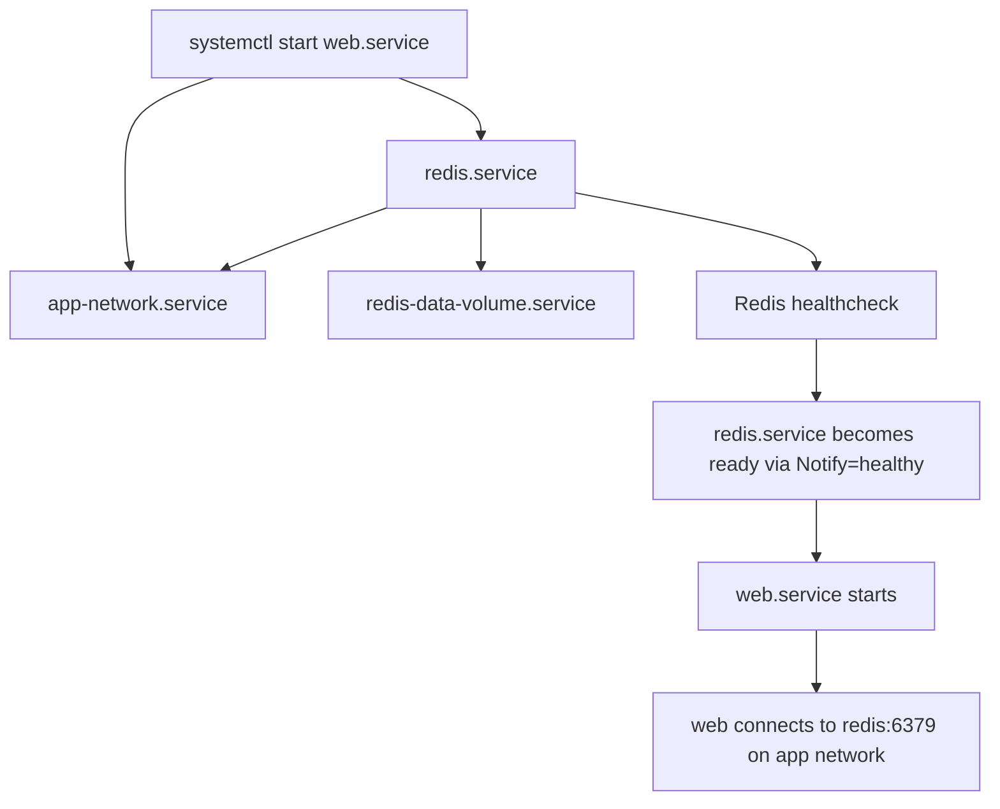

# Podman Quadlet Getting Started

## Executive summary

Podman Quadlet is Podman’s native, declarative bridge into systemd: instead of generating static service files after containers already exist, you place small unit-like source files such as `.container`, `.network`, `.volume`, and `.pod` in Quadlet search paths, and a systemd generator turns them into ordinary `.service` units at boot or on `daemon-reload`. In current Podman documentation, Quadlet is the recommended way to run Podman workloads under systemd, while `podman generate systemd` is explicitly deprecated for new work. 

For a single Linux host, Quadlet is strongest when you want containers to behave like first-class host services: managed by `systemctl`, logged via `journalctl`, started at boot, and usable in both rootless and rootful modes. Docker Compose remains the stronger fit when you want one application-level YAML file and one CLI command (`docker compose up`) to manage a whole development stack. The rest of this page treats those two tools as different operational models rather than direct drop-in replacements. 

## What Quadlet is

Quadlet is a Podman feature set for managing containers, pods, networks, volumes, and images declaratively through systemd unit files. Podman’s own `podman quadlet` documentation describes it as a way to simplify container management on Linux without requiring a full orchestration platform, and the broader Podman documentation points users to Quadlet when they want declarative systemd-managed workloads. 

Conceptually, Quadlet is a **generator model**, not a separate long-running orchestrator. Podman documents that Quadlet files are read during boot and whenever `systemctl daemon-reload` runs; Podman’s systemd generator then creates corresponding regular service units. All standard systemd sections such as `[Unit]`, `[Service]`, and `[Install]` are still valid, while Quadlet-specific sections such as `[Container]`, `[Network]`, `[Volume]`, `[Pod]`, and `[Build]` describe the Podman resource itself.

Quadlet’s core file types are easiest to understand as resource declarations. A `.container` file defines a container service; a `.network` file ensures a Podman network exists; a `.volume` file ensures a named volume exists; and a `.pod` file creates and manages a Podman pod. Current Podman documentation also includes additional file types such as `.build`, `.image`, `.kube`, and `.artifact`; `.build` matters in practice because it is the closest native mapping for a Compose-style `build:` workflow. 

| File type | What it represents | Generated systemd behavior |
|---|---|---|
| `.container` | A running container service | Generates a same-base-name `.service`; by default the actual Podman container name gets a `systemd-` prefix unless `ContainerName=` is set |
| `.network` | A named Podman network | Generates a one-shot `-network.service` that creates the network if needed |
| `.volume` | A named Podman volume | Generates a one-shot `-volume.service` that creates the volume if needed |
| `.pod` | A Podman pod | Generates a `-pod.service` that creates and manages the pod lifecycle |
| `.build` | A local image build definition | Generates a one-shot `-build.service` that builds the image and benefits from layer caching on later runs |

The table above is derived from Podman’s Quadlet documentation and naming rules. 

Quadlet supports both **rootful** and **rootless** placements. For rootful/system units, Podman documents `/run/containers/systemd/`, `/etc/containers/systemd/`, and `/usr/share/containers/systemd/` as search paths, with `/etc/containers/systemd/` being the normal admin-managed location. For rootless/user units, Podman documents `$XDG_RUNTIME_DIR/containers/systemd/`, `$XDG_CONFIG_HOME/containers/systemd/` or `~/.config/containers/systemd/`, plus admin-managed per-user and all-user paths under `/etc/containers/systemd/users/` and `/usr/share/containers/systemd/users/`. Podman also notes that Quadlet does **not** use systemd’s `User=`/`Group=` to switch a unit into a different non-root identity; if you want rootless Quadlets, the files must live in that user’s rootless search path. 

A practical detail that trips people up early is naming. Podman documents that a `.container` named `web.container` generates `web.service`, but unless you explicitly set `ContainerName=web`, the actual container name defaults to `systemd-%N`, meaning something like `systemd-web`. The same pattern exists for volumes and networks unless you override them with `VolumeName=` or `NetworkName=`. For application stacks that rely on service names, it is usually worth setting those names explicitly. 

## Quadlet and Docker Compose

Docker Compose is an **application model** centered on a YAML file that defines services, networks, volumes, configs, and secrets, and a CLI that starts and stops the whole application as one project. Quadlet is a **systemd-integrated resource model** centered on multiple small unit files that become ordinary systemd services. That difference is the main reason the two tools feel different even when they can represent similar small stacks.

| Aspect | Docker Compose | Quadlet | What this means in practice |
|---|---|---|---|
| Configuration style | One `compose.yaml` project file in YAML, based on the Compose Specification | Multiple INI/systemd-style files interpreted by a generator | Compose is app-centric; Quadlet is resource- and service-centric |
| Lifecycle model | `docker compose up/down/logs/ps` operates on the whole project | `systemctl` and `journalctl` operate on generated units | Compose feels like an app tool; Quadlet feels like native host service management |
| Systemd integration | External to Compose itself | Native design goal; generator creates regular systemd units | Quadlet is better when boot ordering, service targets, and host lifecycle matter |
| Build support | Service-level `build:` is part of Compose service definitions | Native today via `.build`, or external `podman build`, but it is still a separate unit/workflow | Compose is more ergonomic for dev-oriented “edit/build/up” loops |
| Health and dependencies | `depends_on` can use `service_started`, `service_healthy`, or `service_completed_successfully`; Compose otherwise only waits until a dependency is running | Ordering is assembled with `After=`/`Requires=` in `[Unit]`; health awareness is achieved with container healthchecks plus `Notify=healthy` | Quadlet can approximate Compose readiness, but you wire it manually |
| Networking | Compose creates a project network automatically and services are discoverable by service name on that network | You normally declare or reference a `.network`; DNS names are derived from container names or aliases on DNS-enabled networks | Compose gives a more automatic app network; Quadlet gives more explicit control |
| Volumes | Top-level volumes are application objects reused by services | `.volume` files create named volumes and can be referenced directly from `.container` files | Both support persistent named volumes, but Quadlet treats them as separate systemd-managed resources |
| Multi-container orchestration scope | Richer project abstraction with merge/include/profile features and a single CLI entry point | Strong for small service graphs, but no single built-in “application project” abstraction equivalent to Compose | Quadlet scales well to host services; Compose stays friendlier for development-centric stacks |

The table above is based on the official Docker Compose application model, service/startup/networking/volume references, and the official Podman Quadlet/systemd documentation. 

A concise way to frame the trade-off is this: **Compose is usually the better developer workflow tool; Quadlet is usually the better Linux service-management tool**. That conclusion is a synthesis from the official models above, not a vendor claim. If you want true Compose semantics on Podman, Podman’s own `podman compose` command is documented as a thin wrapper around an external Compose provider such as `docker-compose` or `podman-compose`; Quadlet is Podman’s native systemd-first path instead. 

## Translating a Compose web and redis stack

Because no literal Compose file was included in the prompt, the translation below assumes an adapted version of Docker’s documented `web` + `redis` sample: a locally built Flask-based web image published as `8000:5000`, Redis using a named volume mounted at `/data`, a Redis healthcheck every five seconds, and a dependency that requires Redis to become healthy before the web service starts. Docker’s sample also places `FLASK_APP=app.py` and `FLASK_RUN_HOST=0.0.0.0` in the image’s Dockerfile, while the web container receives `REDIS_HOST` and `REDIS_PORT` at runtime. 

The most faithful Quadlet translation on a single host is **not** a `.pod`. Podman pods intentionally share one network stack and IP address across pod members, whereas Compose services normally communicate over a shared application network while retaining distinct service identities. For a Compose-style `web`/`redis` pair, a shared Quadlet `.network` with explicit container names or aliases is the closer match.



That startup sequence is based on Podman’s documented dependency translation between Quadlet units, automatic dependencies created by special resource references such as `.network` and `.volume`, and the `Notify=healthy` behavior documented for Quadlet container units. The actual sequence below is therefore an intentional systemd graph, not a single Compose-native dependency object. 

### Mapping the Compose concepts

| Compose concept | Quadlet translation |
|---|---|
| `redis` service | `redis.container` |
| `web` service | `web.container` |
| Compose default/shared network | `app.network` |
| `redis-data` named volume | `redis-data.volume` |
| `depends_on: redis: condition: service_healthy` | `Requires=redis.container` + `After=redis.container` on `web.container`, combined with a healthcheck and `Notify=healthy` on `redis.container` |
| `build: .` for `web` | Primary workflow below: prebuild with `podman build`; optional native workflow: add `web.build` and change `Image=` in `web.container` |

This mapping is derived from the official Docker Compose sample and startup-order docs plus Podman’s Quadlet dependency, healthcheck, volume, network, and build documentation. 

### Generated unit and resource names

| File | Generated systemd unit | Runtime Podman resource |
|---|---|---|
| `app.network` | `app-network.service` | network `app` |
| `redis-data.volume` | `redis-data-volume.service` | volume `redis-data` |
| `redis.container` | `redis.service` | container `redis` |
| `web.container` | `web.service` | container `web` |
| `web.build` | `web-build.service` | image `localhost/compose-demo-web:latest` |

The generated unit names follow Podman’s documented naming rules, while the runtime resource names below are made explicit with `NetworkName=`, `VolumeName=`, and `ContainerName=` so that hostname and storage references are predictable. 

### Exact Quadlet files

The primary example below assumes a **prebuilt local image** for the web service. That is the least ambiguous translation because it avoids path assumptions in the Quadlet file itself. A native `.build` variant follows right after it. Quadlet’s own docs support both approaches: `.build` is current and valid, but it is still a distinct resource/unit rather than an inline Compose-style `build:` key inside a service definition. 

`app.network`

```ini
[Unit]
Description=Bridge network for the compose-demo stack

[Network]
NetworkName=app
Driver=bridge
```

`redis-data.volume`

```ini
[Unit]
Description=Persistent Redis data volume

[Volume]
VolumeName=redis-data
```

`redis.container`

```ini
[Unit]
Description=Redis service for the compose-demo stack

[Container]
ContainerName=redis
Image=docker.io/library/redis:alpine
Network=app.network
NetworkAlias=redis
Volume=redis-data.volume:/data
HealthCmd=["redis-cli","ping"]
HealthInterval=5s
HealthTimeout=3s
HealthRetries=5
HealthStartPeriod=10s
HealthOnFailure=kill
Notify=healthy

[Service]
Restart=always
TimeoutStartSec=900
```

`web.container`

```ini
[Unit]
Description=Web frontend for the compose-demo stack
Requires=redis.container
After=redis.container

[Container]
ContainerName=web
Image=localhost/compose-demo-web:latest
Pull=never
Network=app.network
NetworkAlias=web
PublishPort=8000:5000
Environment=REDIS_HOST=redis
Environment=REDIS_PORT=6379

[Service]
Restart=always
TimeoutStartSec=900

[Install]
# For rootful/system units, use multi-user.target instead.
WantedBy=default.target
```

These files use documented Quadlet keys only: `Network=` and `Volume=` create implicit dependencies on matching `.network` and `.volume` units; `PublishPort=` maps the host port; `Environment=` and `EnvironmentFile=` are the supported ways to inject runtime variables; and `HealthOnFailure=kill` plus `Notify=healthy` is the documented pattern that integrates best with systemd. 

### Required environment and hostname mapping

Docker’s documented quickstart uses three values in `.env`: `APP_PORT`, `REDIS_HOST`, and `REDIS_PORT`. In Quadlet, `APP_PORT` is not best modeled as a container environment variable; it becomes part of the service definition itself via `PublishPort=8000:5000`. The actual runtime variables the web process needs remain `REDIS_HOST=redis` and `REDIS_PORT=6379`. Because we explicitly set `NetworkAlias=redis` and attach both containers to the same custom network, the web service can connect to Redis by using the hostname `redis`, just as Compose services can normally resolve each other by service name on the project network. 

A subtle but important reason to set `ContainerName=` or `NetworkAlias=` explicitly is that Podman documents the default Quadlet container name as `systemd-%N`. If you do nothing, the DNS-visible name may be `systemd-redis` rather than `redis`, which is usually not what a Compose-derived app expects. Explicit names remove that ambiguity. 

### Native `.build` option for the web image

If your Podman version supports current Quadlet `.build` units, you can replace the prebuild workflow with a build unit. Podman documents that a `.build` file needs at least `ImageTag=` and either `File=` or `SetWorkingDirectory=`; Podman also documents that a `.container` can reference the result by setting `Image=web.build`, which automatically creates a dependency on `web-build.service`. 

`web.build`

```ini
[Unit]
Description=Build local web image for the compose-demo stack

[Build]
ImageTag=localhost/compose-demo-web:latest
File=./Dockerfile
SetWorkingDirectory=unit

[Service]
TimeoutStartSec=900
```

If you use that file, change the `web.container` image line from `Image=localhost/compose-demo-web:latest` to:

```ini
Image=web.build
```

This native `.build` workflow is the closest current Quadlet analogue to Compose `build: .`, but it comes with a concrete path assumption: with `File=./Dockerfile` and `SetWorkingDirectory=unit`, the `Dockerfile` and the web application source need to live in the build unit’s directory. If that is not how you want to lay out your files, either use absolute paths in `web.build` or keep the primary “prebuild the image, then run it” workflow above. 

### Dependency semantics, limits, and workarounds

In Compose, Docker documents that `depends_on` controls startup order and that `condition: service_healthy` waits for a dependency to become healthy before starting the dependent service. In Quadlet, the closest equivalent is to express dependency order in `[Unit]` with `Requires=` and `After=` and then mark the dependency service healthy-aware with a real healthcheck plus `Notify=healthy`. Because Quadlet container units default to systemd `Type=notify`, Podman can postpone the startup notification until the Redis healthcheck passes. That makes the pattern above the most practical Quadlet analogue of Compose’s “service must be healthy before the dependent starts.” 

The limitation is that Quadlet does **not** provide one top-level application DSL equivalent to Compose’s single `depends_on` graph. You are explicitly assembling a systemd dependency graph across multiple files. When that is too rigid or not expressive enough, the two standard workarounds are: first, use application-level retry logic so that `web` tolerates `redis` restarts after initial startup; second, model one-shot initialization work as a separate Quadlet container with `Type=oneshot` and `RemainAfterExit=yes`, a pattern Podman documents in its own startup-task example. 

## Installing and operating the units

Quadlet units are discovered from Quadlet search paths, then turned into generated services on `daemon-reload`. Podman documents that generated Quadlet services are transient from systemd’s point of view, so you do **not** make them persistent with `systemctl enable` the way you would with ordinary units. Instead, persistence is expressed in the source file’s `[Install]` section, which the generator applies during generation. 

### Rootless workflow

For rootless/user units, put the Quadlet files in `~/.config/containers/systemd/` or another documented rootless search path. Podman also documents that rootless images are stored under the user’s data directory, so if you keep `Image=localhost/compose-demo-web:latest`, build that image as the **same user** who will run `web.service`. If you need the user service manager to stay alive after logout so the stack starts at boot and keeps running, Podman’s systemd guidance says to enable lingering for that user. 

```bash
# Build the web image as the same non-root user who will run the service
cd ~/src/compose-demo
podman build -t localhost/compose-demo-web:latest .

# Install the Quadlet files
mkdir -p ~/.config/containers/systemd
install -m 0644 app.network redis-data.volume redis.container web.container \
  ~/.config/containers/systemd/

# Regenerate units from Quadlet source
systemctl --user daemon-reload

# Verify that the [Install] stanza has been applied
systemctl --user is-enabled web.service

# Start the application entrypoint; dependencies will be pulled in automatically
systemctl --user start web.service

# Inspect state
systemctl --user status app-network.service redis-data-volume.service redis.service web.service
journalctl --user -u redis.service -u web.service -f

# Optional: keep user services running after logout
sudo loginctl enable-linger "$USER"
```

If you use the native `.build` workflow, also install `web.build` in the same search path and either keep the app source next to that file or adjust `File=` and `SetWorkingDirectory=` accordingly. Starting `web.service` will then pull in `web-build.service` through the special `Image=web.build` dependency. 

### Rootful workflow

For rootful/system units, Podman documents `/etc/containers/systemd/` as a standard admin placement. In this mode, use a system target in `[Install]`; `multi-user.target` is the normal system-unit choice and Podman’s own examples show both `multi-user.target` and `default.target` in system-oriented examples. If you keep a local `localhost/...` image, build it in the same rootful scope that will run the unit. 

```bash
# Build the image in rootful storage if you keep Image=localhost/compose-demo-web:latest
cd /srv/compose-demo
sudo podman build -t localhost/compose-demo-web:latest .

# Install the Quadlet files
sudo install -d -m 0755 /etc/containers/systemd
sudo install -m 0644 app.network redis-data.volume redis.container web.container \
  /etc/containers/systemd/

# Regenerate services
sudo systemctl daemon-reload

# Verify install state and start
sudo systemctl is-enabled web.service
sudo systemctl start web.service

# Inspect state
sudo systemctl status app-network.service redis-data-volume.service redis.service web.service
sudo journalctl -u redis.service -u web.service -f
```

### Rebuild, redeploy, and update

For the **prebuilt-image** workflow, a rebuild is straightforward: rebuild the image with `podman build`, then restart the service so Podman recreates the container from the updated image. Podman documents `podman build` as building from a Dockerfile/Containerfile and a build context, and Quadlet documents `Pull=never` for local-image workflows. 

```bash
cd ~/src/compose-demo
podman build -t localhost/compose-demo-web:latest .
systemctl --user restart web.service
```

For the **native `.build`** workflow, the cleanest explicit sequence is to restart the build unit and then the web unit. Podman documents `.build` as a one-shot service that ensures the image is built and that later runs usually benefit from build cache. 

```bash
systemctl --user restart web-build.service
systemctl --user restart web.service
```

For a **registry-backed image** instead of a local `localhost/...` image, the simplest production shape is to push the image to a registry, set `Image=` in `web.container` to a fully qualified image reference, and optionally set `AutoUpdate=registry`. Podman documents that `AutoUpdate=registry` requires a fully qualified image name, and its `podman-auto-update` service can then restart the unit when a new image becomes available. 

```ini
[Container]
Image=registry.example.com/example/compose-demo-web:1.0
AutoUpdate=registry
```

```bash
# Manual pull + restart
podman pull registry.example.com/example/compose-demo-web:1.0
systemctl --user restart web.service

# Or trigger the auto-update mechanism immediately
systemctl --user start podman-auto-update.service
```

## Troubleshooting and cheat sheet

### Common issues

| Symptom | Likely cause | What to check |
|---|---|---|
| `web` cannot resolve `redis` | Containers are not on the same DNS-capable network, or the hostname is not what you think it is | Make sure both units use `Network=app.network` and set `ContainerName=` or `NetworkAlias=` explicitly; otherwise the default real container name may be `systemd-...` |
| Bind-mounted files fail with `permission denied` on SELinux systems | Host path labels are not usable by the container | Add `:z` or `:Z` to bind mounts; use named volumes where possible if you want fewer SELinux surprises |
| Rootless unit fails on storage or namespace assumptions | Rootless mode uses user-specific storage and subuid/subgid mappings | Verify rootless setup, including `/etc/subuid` and `/etc/subgid`; if a container must write as the invoking user, consider `UserNS=keep-id` |
| Service startup times out when pulling or building | Systemd’s default startup timeout is shorter than image pull/build time | Pre-pull/prebuild, or add `TimeoutStartSec=900` in `[Service]` |
| `web` starts too early anyway | Dependency order exists, but readiness signaling does not | Confirm `redis.container` has a real `HealthCmd=` and `Notify=healthy`; then test it manually with `podman healthcheck run redis` |
| Rootless services do not survive logout | The user systemd instance exits after the last session closes | Enable lingering with `loginctl enable-linger <user>` |
| A unit is “not found” after adding a file | The generator failed, or the file is in the wrong search path | Run `systemctl {--user} daemon-reload`, then use the generator dry-run and `systemd-analyze verify` commands below |

The troubleshooting table above is based on Podman’s documented naming, DNS alias, SELinux volume-label, healthcheck, timeout, rootless, and generator-debug behavior. 

### Essential commands cheat sheet

| Task | Rootless example | Rootful example |
|---|---|---|
| Reload Quadlet generator output | `systemctl --user daemon-reload` | `sudo systemctl daemon-reload` |
| Start the stack | `systemctl --user start web.service` | `sudo systemctl start web.service` |
| Check unit status | `systemctl --user status web.service redis.service` | `sudo systemctl status web.service redis.service` |
| Follow logs | `journalctl --user -u web.service -u redis.service -f` | `sudo journalctl -u web.service -u redis.service -f` |
| Verify install state | `systemctl --user is-enabled web.service` | `sudo systemctl is-enabled web.service` |
| List containers | `podman ps --all` | `sudo podman ps --all` |
| Run the Redis healthcheck now | `podman healthcheck run redis` | `sudo podman healthcheck run redis` |
| Show generator output without installing | `/usr/lib/systemd/system-generators/podman-system-generator --user --dryrun` | `sudo /usr/lib/systemd/system-generators/podman-system-generator --dryrun` |
| Verify the generated unit | `systemd-analyze --user --generators=true verify web.service` | `sudo systemd-analyze --generators=true verify web.service` |
| Trigger image auto-update once | `systemctl --user start podman-auto-update.service` | `sudo systemctl start podman-auto-update.service` |

These commands come directly from Podman’s Quadlet, healthcheck, auto-update, and systemd integration documentation. 

### Common Quadlet keys cheat sheet

| Key | Where | Meaning |
|---|---|---|
| `Image=` | `[Container]` | Image to run; can be a fully qualified registry image, a `.build` unit, or a `.image` unit |
| `ContainerName=` | `[Container]` | Real Podman container name; set this when you need predictable service hostnames |
| `Network=` | `[Container]`, `[Pod]` | Attach to a network; referencing `name.network` creates an implicit dependency |
| `NetworkAlias=` | `[Container]`, `[Pod]` | Additional DNS name on a DNS-enabled network |
| `Volume=` | `[Container]`, `[Pod]`, `[Build]` | Mount a volume or host path; referencing `name.volume` creates an implicit dependency |
| `PublishPort=` | `[Container]`, `[Pod]`, `[Kube]` | Host-to-container port mapping |
| `Environment=` / `EnvironmentFile=` | `[Container]`, `[Build]` | Runtime environment variable injection |
| `HealthCmd=` and related health keys | `[Container]` | Podman healthcheck definition |
| `Notify=healthy` | `[Container]` | Delay readiness notification until the container is healthy |
| `Pull=` | `[Container]`, `[Build]` | Image pull policy such as `missing`, `always`, or `never` |
| `AutoUpdate=` | `[Container]`, `[Kube]` | Opt into auto-update behavior, especially `registry` for FQIN images |
| `NetworkName=` | `[Network]` | Explicit runtime name for the created network |
| `VolumeName=` | `[Volume]` | Explicit runtime name for the created volume |
| `ImageTag=` / `File=` / `SetWorkingDirectory=` | `[Build]` | Native Quadlet build-unit settings |
| `Requires=` / `After=` | `[Unit]` | Explicit service dependency and ordering relationships between Quadlet units |
| `Restart=` / `TimeoutStartSec=` | `[Service]` | Standard systemd lifecycle controls used by generated units |
| `WantedBy=` | `[Install]` | Boot or login activation target; this is the supported persistence mechanism for Quadlet-generated services |

This key summary is compiled from the official Podman Quadlet reference and examples. 